# คู่มือการใช้งาน Qlass

เวอร์ชัน 1.1 · ปรับปรุง 8 ก.ย. 2569

> คู่มือนี้อ่านได้ในแอปที่เมนู “📖 คู่มือการใช้งาน” (มีช่องค้นหาและแบบทดสอบ) ไฟล์นี้เป็นฉบับพิมพ์/ส่งต่อ

## สารบัญ

**เริ่มต้นใช้งาน**

- [🚀 เริ่มต้นใช้งาน: เข้าสู่ระบบและหน้าจอหลัก](#getting-started)
- [🧑‍🤝‍🧑 บทบาทและสิทธิ์: ใครเห็นเมนูอะไร](#roles)

**งานหลัก**

- [📝 บันทึกคิว: ลงคิวใหม่และแก้ไขคิว](#booking)
- [🤖 วิเคราะห์ข้อความอัตโนมัติ (วางจาก LINE)](#smart-parse)
- [⏳ คิวรอ (Waiting Queue)](#waiting-queue)
- [📋 ตารางคิว: ดูและจัดการคิว (รายวันหรือช่วงวันที่)](#queue-table)
- [🔄 สถานะคิวและการเลื่อนนัด](#queue-status)
- [🗓️ Timeline คิว: ภาพรวมทุกเตียงและลงคิวด้วยการกด](#timeline)
- [⛔ ปิดเตียงรายวัน (พนักงานหยุด / เครื่องเสียกะทันหัน)](#bed-switch)

**รายงานและวิเคราะห์**

- [📊 สรุปประจำวัน: คิวที่บันทึก vs คิวนัดทำ](#summary)
- [🟢 คิวว่าง (Capacity): สาขาไหนยังรับเพิ่มได้](#capacity)
- [💰 ค่าคอมมิชชั่น](#commission)
- [📥 Export ข้อมูล: ดาวน์โหลด Excel และสำรองข้อมูล](#export)
- [👑 CEO Dashboard](#ceo-dashboard)
- [🎫 แจ้งปัญหาระบบ](#tickets)
- [🔍 ประวัติการลบคิว](#activity-log)

**ตั้งค่าระบบ**

- [🏢 จัดการสาขา](#branches)
- [💉 จัดการหัตถการและหมวดหมู่](#procedures)
- [🏷️ จัดการโปร/แพ็กเกจ](#promos)
- [🚪 จัดการห้อง/เตียง และล็อกหัตถการรายเตียง](#rooms)
- [📅 ตารางห้อง/เครื่อง: วันพิเศษ ปิดซ่อม ต่อเวลา และโน้ตรายวัน](#room-schedule)
- [👥 จัดการพนักงาน: บัญชี บทบาท PIN และเรตค่าคอม](#staff)

**กติกาและปัญหาที่พบบ่อย**

- [📏 กติกาสำคัญที่ใช้ทั้งระบบ](#rules)
- [❓ ปัญหาที่พบบ่อยและวิธีแก้](#faq)
- [📚 คำศัพท์ในระบบ](#glossary)

---

# เริ่มต้นใช้งาน

## 🚀 เริ่มต้นใช้งาน: เข้าสู่ระบบและหน้าจอหลัก

Qlass เป็นระบบจัดการคิวของคลินิก ใช้ผ่านเว็บเบราว์เซอร์ได้ทั้งคอมพิวเตอร์และมือถือ ไม่ต้องติดตั้งโปรแกรม ข้อมูลทุกเครื่องเห็นตรงกันแบบทันที (Realtime) — ภาพประกอบในคู่มือถ่ายจากบัญชีผู้ดูแลระบบด้วยข้อมูลสาธิต เมนูและปุ่มของคุณอาจมีน้อยกว่าในภาพตามบทบาท

**คำที่จะเจอบ่อยในคู่มือ (อ่านก่อน 1 นาที)**

| คำ | หมายถึง |
| --- | --- |
| บล็อค | หน่วยเวลา 5 นาที ทุกอย่างในระบบนับเป็นบล็อค เช่น Botox 3 บล็อค = 15 นาที |
| ห้อง M / ห้อง T | M = ห้องฉีด/ห้องหมอ (Botox, Filler, ร้อยไหม, ดริป, Meso) — T = ห้องเครื่อง/ทรีตเมนต์ (เลเซอร์, HIFU, Pico, Diode, ทรีตเมนต์ผิว) |
| เตียง | แถวหนึ่งในหน้าจัดการห้อง = เตียง 1 ตัวพร้อมคนทำ ระบบเรียกสลับกันว่า “ห้อง” และ “เตียง” |
| ล็อกเตียง 🔒 | การกำหนดว่าเตียงนั้นรับเฉพาะหัตถการที่ระบุ (มีเครื่องนั้นจริง) |
| Pro Clinic / HN | Pro Clinic คือระบบเวชระเบียนของคลินิก HN คือรหัสลูกค้าในระบบนั้น Qlass ค้นให้ตอนพิมพ์เบอร์/ชื่อ |
| walk-in | ลูกค้าที่เดินเข้ามาโดยไม่ได้จองล่วงหน้า (ในระบบคือการลงคิววันที่วันนี้ ซึ่งได้สถานะยืนยันแล้วทันที) |
| คิวรอ | คิวที่ยังไม่มีห้อง/เวลา |

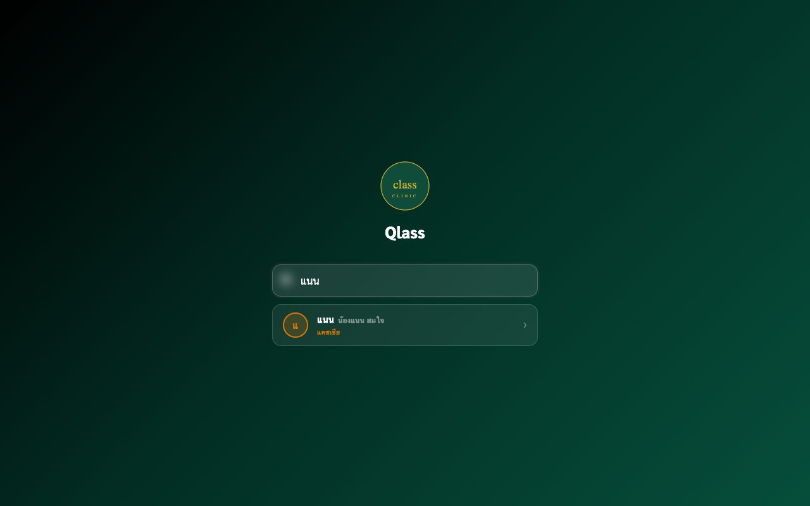
*หน้าเข้าสู่ระบบ: พิมพ์ชื่อหรือชื่อเล่นแล้วกดชื่อของคุณ*

**วิธีเข้าสู่ระบบ**

1. เปิดลิงก์ระบบ Qlass ในเบราว์เซอร์ (แนะนำ Chrome หรือ Safari) — ลิงก์และ PIN ของคุณจะได้รับจากหัวหน้าแอดมินตอนสร้างบัญชี ถ้ายังไม่มีให้ขอก่อนเริ่มงาน
2. พิมพ์ชื่อหรือชื่อเล่นของคุณในช่อง “พิมพ์ชื่อหรือชื่อเล่น...” — รายชื่อจะโผล่เมื่อเริ่มพิมพ์ (ก่อนพิมพ์เห็นแค่ “n บัญชีที่ใช้งานได้”) แล้วกดชื่อของคุณ ถ้าขึ้น “ไม่พบพนักงานชื่อ …” ให้ลองพิมพ์ชื่อเล่น หรือแจ้งหัวหน้าว่าบัญชีอาจถูกปิด
3. กดตัวเลข PIN 4 หลักบนแป้นตัวเลข — พอครบ 4 หลักระบบจะตรวจให้ทันที ไม่ต้องกดปุ่มตกลง
4. ถ้าถูกต้อง จะเห็นข้อความ “ยินดีต้อนรับ {ชื่อ} 👋” และเข้าสู่หน้าแรกของบทบาทคุณโดยอัตโนมัติ (แคชเชีย แอดมิน ผู้จัดการสาขา หัวหน้าแอดมิน และผู้ดูแลระบบ เริ่มที่ “บันทึกคิว” ส่วน CEO เริ่มที่ “CEO Dashboard”)
5. ถ้าผิด จุด PIN จะเป็นสีแดงพร้อมข้อความ “PIN ไม่ถูกต้อง ลองใหม่” — กดใหม่ได้เลย หรือกด “← กลับ” เพื่อเลือกชื่ออื่น

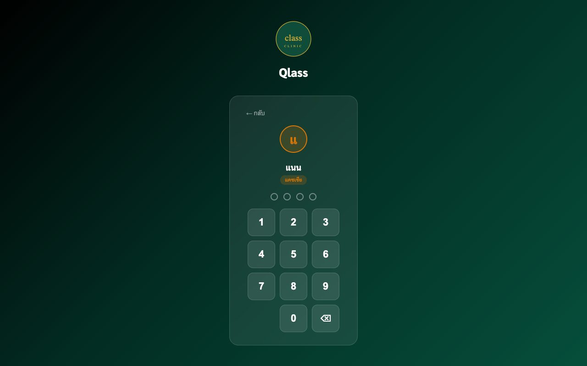
*หน้ากด PIN 4 หลัก — ครบ 4 หลักระบบตรวจให้ทันที*

> ⚠️ **ข้อควรระวัง**
> - กด PIN ผิดครบ 5 ครั้งติดกัน บัญชีนั้นจะถูกพักชั่วคราว 15 นาที (จากเครื่อง/เครือข่ายเดิม) หน้าจอจะยังขึ้น “PIN ไม่ถูกต้อง ลองใหม่” เหมือนเดิม — ข้อความเดียวกันนี้ขึ้นเมื่ออินเทอร์เน็ตหลุดด้วย ถ้ามั่นใจว่ากดถูกแล้วยังเข้าไม่ได้ ให้เช็กเน็ตแล้วรอ 15 นาทีลองใหม่
> - การเข้าสู่ระบบมีอายุ 8 ชั่วโมง ถ้าเปิดหน้าจอค้างไว้เกินนั้น เมื่อรีเฟรชหรือเปิดใหม่ระบบจะให้เข้าสู่ระบบอีกครั้ง (ข้อมูลที่บันทึกไว้ไม่หาย)
> - ห้ามบอก PIN ให้คนอื่น — ทุกคิวที่บันทึกจะติดชื่อ “บันทึกโดย” ของเจ้าของ PIN และใช้คำนวณค่าคอมมิชชั่น

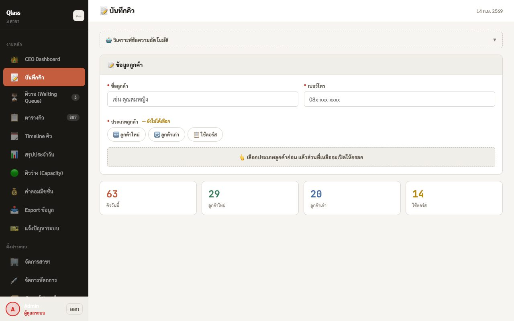
*โครงหน้าจอ: แถบเมนูซ้าย (แบ่งกลุ่ม งานหลัก / ตั้งค่าระบบ / ช่วยเหลือ), แถบบนบอกชื่อหน้าและวันที่, ตัวเลขแดงข้างเมนูคือจำนวนคิว*

**ส่วนประกอบของหน้าจอ**

- แถบเมนูด้านซ้าย — รายการเมนูที่บทบาทของคุณใช้ได้ แบ่งเป็นกลุ่ม “งานหลัก”, “ตั้งค่าระบบ” และ “ช่วยเหลือ” บนคอมพิวเตอร์มีปุ่ม ← / → ที่หัวแถบใช้หุบ/ขยายเมนู
- ตัวเลขสีแดงข้างเมนู “ตารางคิว” = จำนวนคิวลูกค้าใหม่+เก่าของเดือนนี้ในสาขาที่คุณเห็น, ข้าง “คิวรอ” = จำนวนคิวที่ยังรออยู่
- มุมล่างซ้าย — ชื่อและบทบาทของคุณ พร้อมปุ่ม “ออก” สำหรับออกจากระบบ
- แถบบน — ชื่อหน้าปัจจุบันและวันที่วันนี้ ถ้าเห็นป้าย “🎯 โหมดตัวอย่าง” แปลว่าระบบต่อฐานข้อมูลไม่ได้ กำลังแสดงข้อมูลสาธิต ให้แจ้งผู้ดูแลระบบ
- แถบเหลือง “มีเวอร์ชันใหม่…” — กด “รีเฟรชตอนนี้” เมื่อสะดวก เพื่อโหลดระบบเวอร์ชันล่าสุด
- แถบ “⏳ กำลังโหลดข้อมูล …” — ขึ้นเมื่อคุณเลือกดูวันที่เก่ากว่า 30 วัน ระบบกำลังดึงข้อมูลเก่าเพิ่ม รอให้หายก่อนค่อยอ่านตัวเลข ถ้าขึ้น “⚠️ โหลดข้อมูล … ไม่สำเร็จ” ให้กด “ลองใหม่”

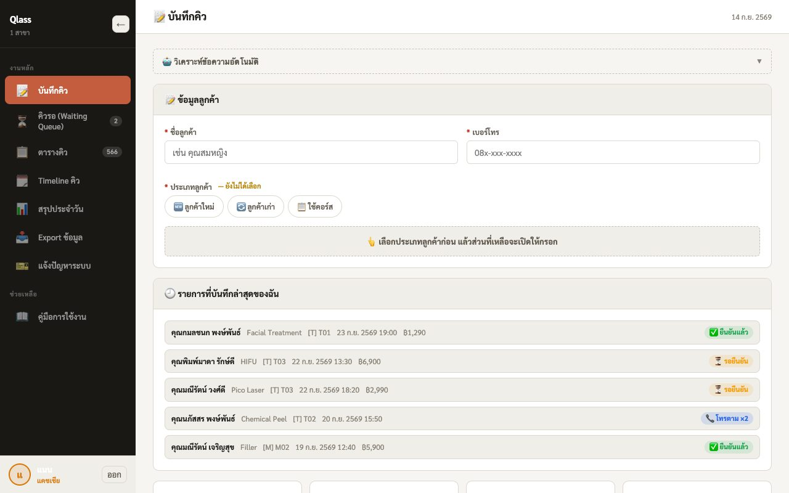
*หน้าจอของแคชเชีย: เมนูซ้ายมีเฉพาะที่บทบาทใช้ได้ และแถบเมนูบอกจำนวนสาขาที่เห็น (1 สาขา)*

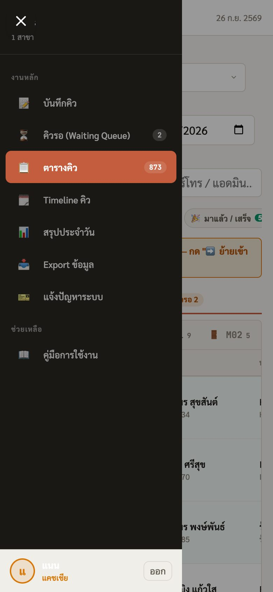
*บนมือถือ กด ☰ มุมบนซ้ายเพื่อเปิดเมนู*

**ใช้บนมือถือ**

- กดปุ่ม ☰ มุมบนซ้ายเพื่อเปิดเมนู กดพื้นที่มืดหรือ ✕ เพื่อปิด (ภาพด้านบนเป็นเมนูของแคชเชีย)
- ตารางที่กว้างจะเลื่อนซ้าย-ขวาได้ด้วยการปัดนิ้ว
- ข้อความแจ้งเตือน (toast) จะโผล่ด้านบนของจอแทนมุมล่างขวา
- หน้า Timeline มีแถบควบคุม 2 แถวและคำอธิบายสีแบบย่อ ถ้าหมุนจอแล้วตารางเพี้ยน ให้รีเฟรชหน้า 1 ครั้ง

**กิจวัตรประจำวันของทีมหน้าร้าน (แคชเชีย / ผู้จัดการสาขา)**

| เวลา | ทำอะไร | ที่เมนู |
| --- | --- | --- |
| เปิดร้าน | เข้าสู่ระบบ → ดู Timeline วันนี้ว่ามีเตียงปิด (⛔) หรือโน้ต (📅) ไหม → เปิดตารางคิววันนี้ โทรยืนยันคิว “รอยืนยัน” และกด “📞 โทรตาม” ทุกครั้งที่โทร | Timeline, ตารางคิว |
| ลูกค้า walk-in | ลงคิววันที่วันนี้ได้ 2 ทาง: กดช่องว่างเวลาปัจจุบันใน Timeline (เร็วกว่า) หรือหน้าบันทึกคิว — ได้สถานะ “ยืนยันแล้ว” ทันที แต่เมื่อทำเสร็จยังต้องกด “🎉 มาแล้ว / เสร็จ” เหมือนคิวอื่น | Timeline หรือ บันทึกคิว |
| หลัง 12:00 | ดูแถบเตือน “⚠️ n คิวยังไม่ยืนยัน” คิวที่ติดต่อไม่ได้ให้กด “➡️ ย้ายเข้าคิวรอ” เพื่อปล่อยเวลาให้ลูกค้าคนอื่น | ตารางคิว |
| ลูกค้ามาทำเสร็จ | กด “📋 สถานะ” → “🎉 มาแล้ว / เสร็จ” ทันทีที่ทำเสร็จ (ค่าคอมและรายได้นับจากปุ่มนี้) คนไม่มาให้กด “🚫 ไม่มาตามนัด” คนโทรมายกเลิกให้กด “❌ ยกเลิก” | ตารางคิว |
| ก่อนปิดร้าน | กวาดตาตารางคิววันนี้ ไม่ให้เหลือแถวที่ยังเป็น “ยืนยันแล้ว” หรือ “รอยืนยัน” ทั้งที่วันจบแล้ว แล้วกด “ออก” ถ้าเป็นเครื่องส่วนกลาง | ตารางคิว |

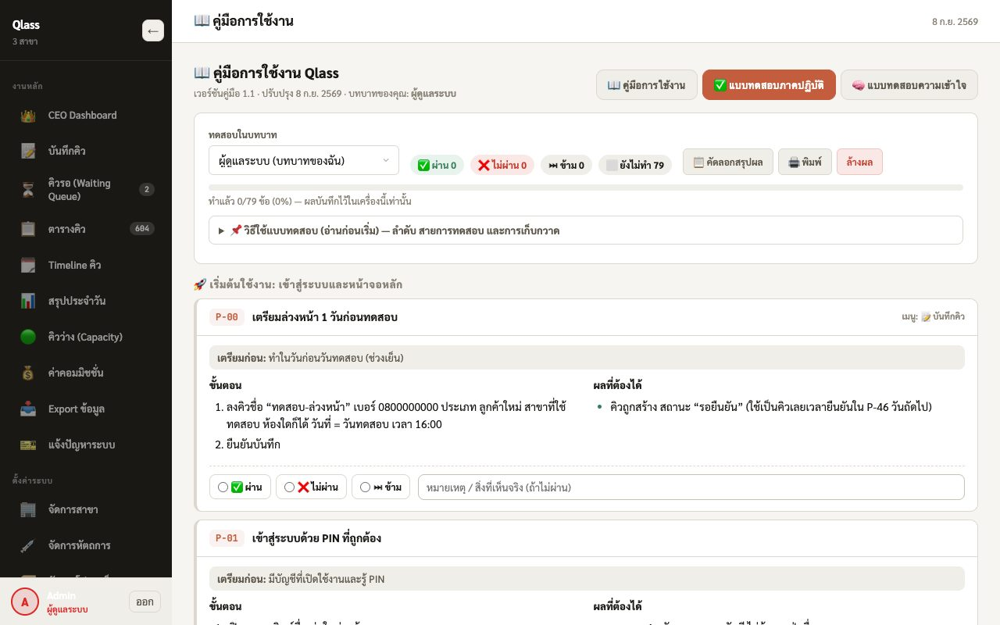
*เมนู “คู่มือการใช้งาน” มีแท็บแบบทดสอบภาคปฏิบัติให้ติ๊กผลและคัดลอกสรุปส่งหัวหน้าได้*

**ออกจากระบบ**

1. กดปุ่ม “ออก” ที่มุมล่างซ้ายของแถบเมนู (ถ้าเมนูหุบอยู่จะเป็นปุ่ม ⎋)
2. ระบบจะกลับไปหน้าเลือกชื่อ ควรออกจากระบบทุกครั้งเมื่อใช้เครื่องร่วมกับคนอื่น

> 💡 **เคล็ดลับ**
> - ระบบจำหน้าล่าสุดที่คุณเปิดไว้ รีเฟรชแล้วจะกลับมาหน้าเดิม (แต่ทุกครั้งที่เข้าสู่ระบบใหม่จะเริ่มที่หน้าแรกของบทบาท)
> - เข้าเมนูใดก็ได้โดยตรงด้วยการเติม # ท้ายลิงก์ เช่น …/#timeline (ต้องเป็นเมนูที่บทบาทคุณใช้ได้)

## 🧑‍🤝‍🧑 บทบาทและสิทธิ์: ใครเห็นเมนูอะไร

ระบบมี 6 บทบาท แต่ละบทบาทเห็นเมนูไม่เท่ากัน และบางบทบาทเห็นข้อมูลเฉพาะสาขาตัวเอง

**บทบาททั้ง 6**

| บทบาท | เห็นสาขา | เมนูที่ใช้ได้ |
| --- | --- | --- |
| CEO | ทุกสาขา | CEO Dashboard, สรุปประจำวัน, คิวว่าง (Capacity), คู่มือ |
| ผู้ดูแลระบบ | ทุกสาขา | ทุกเมนู |
| หัวหน้าแอดมิน | ทุกสาขา | ทุกเมนู ยกเว้น “จัดการสาขา” |
| แอดมิน | ทุกสาขา | บันทึกคิว, คิวรอ, ตารางคิว, Timeline, สรุปประจำวัน, คิวว่าง, ค่าคอมมิชชั่น, Export, แจ้งปัญหา, ตารางห้อง/เครื่อง, คู่มือ |
| ผู้จัดการสาขา | เฉพาะสาขาตัวเอง | บันทึกคิว, คิวรอ, ตารางคิว, Timeline, สรุปประจำวัน, Export, แจ้งปัญหา, จัดการห้อง, ตารางห้อง/เครื่อง, คู่มือ |
| แคชเชีย | เฉพาะสาขาตัวเอง | บันทึกคิว, คิวรอ, ตารางคิว, Timeline, สรุปประจำวัน, Export, แจ้งปัญหา, คู่มือ |

**สิทธิ์พิเศษที่ซ่อนอยู่ในหน้าต่าง ๆ**

| การกระทำ | ใครทำได้ |
| --- | --- |
| ปุ่ม “➕ เพิ่มโปรด่วน” ในหน้าบันทึกคิว | ผู้ดูแลระบบ, หัวหน้าแอดมิน |
| ปุ่ม “กดปิดเตียง / กดเปิดคืน” บนหัวคอลัมน์ Timeline | ผู้จัดการสาขาขึ้นไป (ผู้จัดการสาขา, แอดมิน, หัวหน้าแอดมิน, ผู้ดูแลระบบ) |
| ติ๊ก 🔒 หัตถการที่เตียงรับ (ในจัดการห้อง) | ผู้จัดการสาขา (สาขาตัวเอง), หัวหน้าแอดมิน, ผู้ดูแลระบบ |
| เปลี่ยนสถานะ/ลบคำร้องแจ้งปัญหา | ผู้ดูแลระบบ, หัวหน้าแอดมิน |
| ดูการ์ดค่าโฆษณาในหน้าสรุปประจำวัน | ผู้ดูแลระบบเท่านั้น |
| ลบคิว / แก้ไขคิว / ย้ายเข้าคิวรอ / เปลี่ยนสถานะคิว | ทุกบทบาทที่เห็นคิวนั้น (รวมแคชเชีย) — การลบต้องพิมพ์ชื่อลูกค้ายืนยัน และถูกบันทึกในประวัติการลบ |
| เพิ่ม/แก้ไข/ปิดบัญชีพนักงาน | ผู้ดูแลระบบ, หัวหน้าแอดมิน |

> 💡 **เคล็ดลับ**
> - ผู้จัดการสาขาและแคชเชียจะเห็นตัวกรอง “สาขา” มีแค่สาขาตัวเอง (บางหน้าเช่นสรุปประจำวันจะซ่อนตัวกรองไปเลย) เพราะระบบจำกัดสาขาให้แล้ว
> - ถ้าต้องการเมนูเพิ่ม ให้ผู้ดูแลระบบหรือหัวหน้าแอดมินเปลี่ยนบทบาทในเมนู “จัดการพนักงาน”

---

# งานหลัก

## 📝 บันทึกคิว: ลงคิวใหม่และแก้ไขคิว

เมนู: 📝 บันทึกคิว  
ใช้ได้กับบทบาท: ผู้ดูแลระบบ · หัวหน้าแอดมิน · แอดมิน · ผู้จัดการสาขา · แคชเชีย

หน้านี้ใช้ลงคิวลูกค้าใหม่ 1 คนต่อครั้ง และเป็นหน้าที่ระบบพาคุณมาเมื่อกด “✏️ แก้ไข” จากตารางคิว, Timeline หรือ “📞 เรียกเข้า” จากคิวรอ

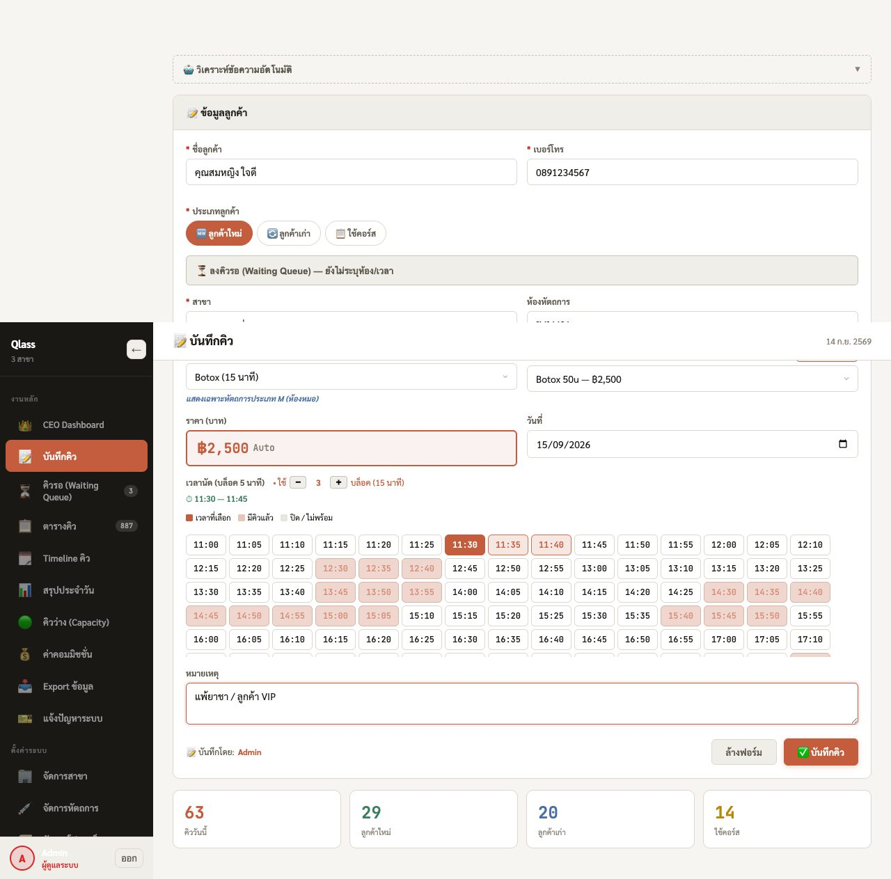
*ฟอร์มบันทึกคิวที่กรอกครบ: ราคาเติมจากโปรอัตโนมัติ ช่องเวลาสีเข้ม = ที่เลือก สีชมพู = มีคิวแล้ว*

**ลงคิวใหม่ทีละขั้น**

1. (ทางลัด) ถ้ามีข้อความจาก LINE ให้วางในกล่อง “🤖 วิเคราะห์ข้อความอัตโนมัติ” แล้วกด “✨ เติมข้อมูลในฟอร์ม” — ดูหัวข้อ “วิเคราะห์ข้อความอัตโนมัติ” ประกอบ
2. กรอก “ชื่อลูกค้า” และ “เบอร์โทร” (บังคับทั้งคู่) — ขณะพิมพ์เบอร์ตั้งแต่ 4 หลัก หรือชื่อตั้งแต่ 2 ตัวอักษร ระบบจะค้นลูกค้าเก่าใน Pro Clinic ให้ (ขึ้น “⏳ ค้นหา HN...” ครู่หนึ่ง) กดชื่อที่เจอเพื่อเติมชื่อ-เบอร์และตั้งประเภทเป็น “ลูกค้าเก่า” อัตโนมัติ ถ้าเห็นป้าย “🟡 ข้อมูลบางส่วน” แปลว่าค้นได้ไม่ครบทุกสาขา ให้แจ้งผู้ดูแลระบบ
3. เลือก “ประเภทลูกค้า”: 🆕 ลูกค้าใหม่ (ค่าเริ่มต้น) / 🔄 ลูกค้าเก่า / 📋 ใช้คอร์ส — ค่านี้มีผลกับค่าคอมมิชชั่นและรายงาน
4. เลือก “สาขา” (บังคับ — ผู้จัดการสาขา/แคชเชียจะมีให้เลือกแค่สาขาตัวเองแต่ยังต้องกดเลือก) แล้วเลือก “ห้องหัตถการ” — รายการห้องแสดงเป็น [M] หรือ [T] นำหน้า: งานฉีด/ดริป/ร้อยไหม เลือกห้อง [M], งานเลเซอร์/HIFU/Pico/ทรีตเมนต์ เลือกห้อง [T] ใต้ช่องอาจมีป้าย “🔒 เตียงนี้รับ: …” (เตียงที่ล็อกหัตถการไว้), “⚠️ …” (หมายเหตุประจำห้อง) หรือ “📅 …” (โน้ตของวันนั้น)
5. เลือก “หัตถการหลักที่สนใจ” — เมื่อเลือกห้องแล้ว ระบบจะโชว์เฉพาะหัตถการที่ห้องนั้นรับได้ (ตามประเภท M/T หรือตามที่ล็อกไว้) แต่ละรายการบอกจำนวนนาที (ถ้ายังไม่เลือกห้องจะเห็นทุกหัตถการ) — ควรเลือกหัตถการทุกครั้ง เพราะคิวที่ไม่มีหัตถการระบบไม่รู้ความยาว จึงตรวจเวลาชนให้ไม่ได้
6. เลือก “โปร/แพ็กเกจที่เลือก” — ราคาจะเติมให้อัตโนมัติในช่อง “ราคา (บาท)” (แก้เองไม่ได้ ราคาเปลี่ยนตามโปร)
7. เลือก “วันที่” — ลงคิวใหม่ย้อนหลังไม่ได้ (เลือกได้ตั้งแต่วันนี้เป็นต้นไป)
8. กดช่องเวลาใน “เวลานัด (บล็อค 5 นาที)” — ช่องสีเข้ม = เวลาที่เลือก, ช่องชมพู = มีคิวแล้ว (กดแล้วจะเตือน “⚠️ … มีคิวอยู่แล้ว”), ช่องเทา = ห้องปิด/ไม่พร้อม ด้านบนจะสรุปช่วงเวลา เช่น Botox 15 นาที กด 15:00 จะได้ “⏱ 15:00 — 15:15” หรือเตือน “⚠️ ชนกับคิวอื่น!”
9. (ถ้าจำเป็น) ปรับความยาวคิวด้วยปุ่ม − / + ข้าง “ใช้ … บล็อค” เช่น ลูกค้าทำ 2 อย่างต่อกัน — เมื่อปรับแล้วจะมีปุ่ม “reset” โผล่มาให้กดกลับค่ามาตรฐานของหัตถการ
10. ใส่ “หมายเหตุ” ถ้ามี เช่น แพ้ยาชา, VIP, คอร์สเหลือ 2 ครั้ง
11. กด “✅ บันทึกคิว” → ตรวจข้อมูลในหน้าต่าง “✅ ยืนยันการบันทึกคิว” (หน้าต่างนี้เปิดเสมอ ระบบจะตรวจความครบถ้วนตอนกดยืนยัน; หน้าต่างไม่แสดง “ประเภทลูกค้า” ให้เช็กปุ่มในฟอร์มก่อนกด) → กด “✅ ยืนยันบันทึก” (กด “แก้ไข” ถ้าต้องการกลับไปแก้)
12. เห็นข้อความ “บันทึกคิวเรียบร้อย ✓” ฟอร์มจะถูกล้าง และคิวจะไปโผล่ในตารางคิว/Timeline ทันที รวมถึงในการ์ด “🕘 รายการที่บันทึกล่าสุดของฉัน” ด้านล่าง

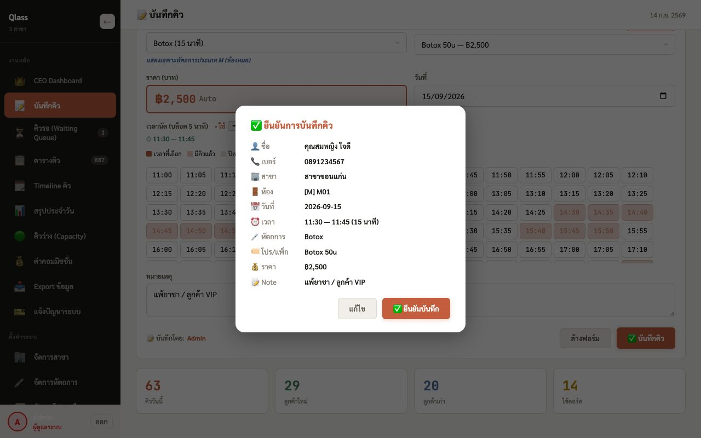
*หน้าต่างยืนยันก่อนบันทึก ตรวจทุกช่องแล้วกด “✅ ยืนยันบันทึก” หรือ “แก้ไข” เพื่อกลับไปแก้*

**สิ่งที่ระบบทำให้อัตโนมัติ**

- คิวที่นัด “วันนี้” จะได้สถานะ “ยืนยันแล้ว” ทันที (ลูกค้า walk-in) ส่วนคิวล่วงหน้าจะเป็น “รอยืนยัน”
- เปลี่ยนสาขา → ระบบล้างห้อง/หัตถการ/โปร; เปลี่ยนห้อง → ล้างหัตถการ/โปร; เปลี่ยนหัตถการ → ล้างโปร/ราคา/เวลา และความยาวที่ปรับไว้ ต้องเลือกใหม่ตามลำดับ
- เมื่อเลือกห้อง เวลา และหัตถการครบ ระบบจะตรวจเวลาชนจากฐานข้อมูลสด ๆ ก่อนบันทึก แม้อีกเครื่องจะเพิ่งลงคิวทับเมื่อวินาทีก่อนก็จะถูกเตือน
- กดปุ่มบันทึกรัว ๆ ไม่ทำให้เกิดคิวซ้ำ
- ถ้าบันทึกไม่สำเร็จจะขึ้น “บันทึกคิวไม่สำเร็จ ข้อมูลในฟอร์มยังอยู่ครบ กรุณาลองอีกครั้ง” ข้อมูลในฟอร์มจะยังอยู่ครบ ลองกดยืนยันใหม่ได้เลย

**ลงคิวรอ (ยังไม่รู้ห้อง/เวลา)**

1. กรอกชื่อ เบอร์ ประเภทลูกค้า และสาขาตามปกติ
2. กดปุ่ม “⏳ ลงคิวรอ (Waiting Queue) — ยังไม่ระบุห้อง/เวลา” ช่องห้องและเวลาจะหายไป (ปุ่มนี้มีเฉพาะตอนลงคิวใหม่ ตอนแก้ไขคิวปกติจะไม่มี)
3. เลือกหัตถการ/โปร/วันที่ (ถ้ารู้) แล้วบันทึก — คิวจะไปอยู่ในเมนู “คิวรอ” เพื่อ “📞 เรียกเข้า” ทีหลัง

**แก้ไขคิวเดิม**

1. ไปที่ตารางคิว / Timeline / คิวรอ แล้วกด “✏️ แก้ไข” (หรือ “✏️ แก้ไขคิวนี้”, “📞 เรียกเข้า”) — ระบบจะพามาหน้านี้ หัวหน้าจอเปลี่ยนเป็น “✏️ แก้ไขคิว” และมีปุ่ม “✕ ยกเลิกแก้ไข”
2. แก้ข้อมูลที่ต้องการ แล้วกด “💾 บันทึกการแก้ไข” → “💾 ยืนยันแก้ไข”
3. ตอนแก้ไขเลือกวันย้อนหลังได้ (ใช้แก้คิวเก่าที่ลงผิด)
4. ถ้าแค่แก้ชื่อ/เบอร์/ราคา โดยไม่ย้ายเตียงหรือเวลา ระบบจะยอมบันทึกแม้เตียงนั้นถูกปิดไปแล้ว แต่ถ้าย้ายเตียง/เลื่อนเวลา/เปลี่ยนหัตถการ จะถูกตรวจกติกาใหม่ทั้งหมด

**เพิ่มโปรด่วน (ผู้ดูแลระบบ / หัวหน้าแอดมินเท่านั้น)**

1. กด “➕ เพิ่มโปรด่วน” ข้างหัวข้อ “โปร/แพ็กเกจที่เลือก”
2. เลือกหัตถการ พิมพ์ชื่อโปร และราคา แล้วกด “บันทึก” (กด Enter ในช่องชื่อหรือราคาก็ได้)
3. ถ้าชื่อซ้ำกับโปรที่มีอยู่ ระบบจะเตือน “⚠️ มีโปร … อยู่แล้ว” และเมื่อกดบันทึกจะเลือกโปรเดิมให้แทน ไม่สร้างซ้ำ
4. สำเร็จจะขึ้น “เพิ่มโปร … แล้ว” และโปรใหม่ถูกเลือกในฟอร์มทันที

**ข้อความเตือนที่พบและวิธีแก้**

| ข้อความ | สาเหตุ | ทำอย่างไร |
| --- | --- | --- |
| กรุณากรอกชื่อและเบอร์โทร | ช่องชื่อหรือเบอร์ว่าง | กรอกให้ครบ |
| กรุณาเลือกสาขา | ยังไม่เลือกสาขา | เลือกสาขา |
| ไม่สามารถบันทึกคิวย้อนหลังได้ | ลงคิวใหม่ด้วยวันที่ผ่านมาแล้ว | เปลี่ยนเป็นวันนี้หรืออนาคต (คิวเก่าให้ใช้ “แก้ไข” จากคิวที่มีอยู่) |
| ❌ {เตียง} ไม่รับคิว {หัตถการ} — กรุณาเลือกเตียงอื่น… | เตียงถูกล็อกไว้ให้เฉพาะบางหัตถการ | เลือกเตียงที่มีเครื่องนั้น หรือให้ผู้จัดการสาขาแก้ที่ “จัดการห้อง” |
| ห้องนี้ปิดรับคิวหรือปิดให้บริการในเวลาที่เลือก | เวลาที่เลือกอยู่นอกเวลาเปิด หรือห้องถูกปิดในตารางห้อง/เครื่อง | เลือกเวลาหรือห้องอื่น |
| {ชื่อ} ({เบอร์}) มีคิววันนี้แล้ว (…) | ระบบไม่ยอมบันทึก เพราะเบอร์นี้มีคิวหัตถการเดียวกันในวันเดียวกันอยู่แล้ว (นับรวมคิวที่ยกเลิก/ไม่มาแล้ว และคิวของสาขาอื่นด้วย) คิวซ้ำจึงเกิดได้เฉพาะเมื่อลงคนละหัตถการ/คนละวัน หรือพิมพ์เบอร์ต่างกัน | ตรวจในตารางคิวหรือคิวรอก่อนว่าซ้ำจริงไหม ถ้าลูกค้าต้องการ 2 คิวจริงให้เปลี่ยนหัตถการหรือลงต่างวัน |
| เวลาชนกับคิวของ {ชื่อ} (…) | มีคนลงคิวช่วงเวลานั้นไปแล้ว (อาจเพิ่งลงจากเครื่องอื่น) | เลือกเวลาอื่น หน้าจอจะอัปเดตคิวใหม่ให้เอง |
| ตรวจสอบเวลาห้องไม่สำเร็จ ข้อมูลยังไม่ถูกบันทึก | อินเทอร์เน็ตสะดุดตอนตรวจชน | กดยืนยันอีกครั้ง |
| ยังไม่ได้เลือกห้อง/เวลา — คิวนี้จะยังอยู่ในคิวรอ | เรียกคิวรอเข้าแต่ยังไม่เลือกห้อง | เลือกห้องและเวลาก่อนบันทึก |

> 💡 **เคล็ดลับ**
> - แถบสถิติล่างสุด (“คิววันนี้”, “ลูกค้าใหม่”, “ลูกค้าเก่า”, “ใช้คอร์ส”) นับเฉพาะสาขาที่คุณเห็น ใช้เช็กยอดวันนี้แบบเร็ว ๆ
> - อยากลงคิวหลายคนเร็ว ๆ ในวันเดียวกัน ใช้หน้า Timeline กดช่องว่างจะเร็วกว่า เพราะห้อง/วัน/เวลาถูกเติมให้แล้ว

## 🤖 วิเคราะห์ข้อความอัตโนมัติ (วางจาก LINE)

เมนู: 📝 บันทึกคิว  
ใช้ได้กับบทบาท: ผู้ดูแลระบบ · หัวหน้าแอดมิน · แอดมิน · ผู้จัดการสาขา · แคชเชีย

กล่อง “🤖 วิเคราะห์ข้อความอัตโนมัติ” ด้านบนหน้าบันทึกคิว อ่านข้อความที่ลูกค้าหรือแอดมินพิมพ์มา แล้วแยกเป็นช่องต่าง ๆ ให้ คุณแค่ตรวจแล้วกดเติม

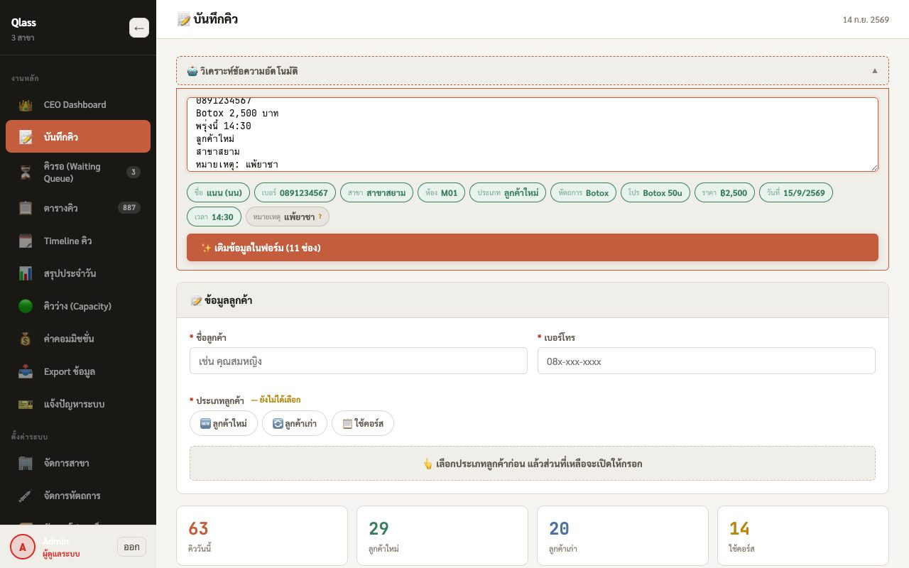
*วางข้อความจาก LINE แล้วระบบแยกเป็นชิป ชิปเขียว = มั่นใจ ชิปเทามี ? = ควรตรวจ*

**วิธีใช้**

1. กดหัวข้อ “🤖 วิเคราะห์ข้อความอัตโนมัติ” เพื่อเปิดกล่อง
2. วาง (Paste) ข้อความจาก LINE/แชท ระบบจะวิเคราะห์ทันทีและแสดงเป็นชิป เช่น ชื่อ, เบอร์, สาขา, หัตถการ, โปร, ราคา, วันที่, เวลา, ประเภท, หมายเหตุ
3. ชิปสีเขียว = มั่นใจ, ชิปสีเทามี “?” = ไม่แน่ใจ ควรตรวจก่อน
4. กด “✨ เติมข้อมูลในฟอร์ม (n ช่อง)” ระบบจะเติมเฉพาะช่องที่วิเคราะห์ได้ ช่องที่คุณกรอกไว้แล้วจะไม่ถูกทับถ้าระบบอ่านไม่ได้
5. ตรวจฟอร์มอีกครั้ง โดยเฉพาะห้องและเวลา แล้วบันทึกตามปกติ

**ระบบอ่านอะไรได้บ้าง**

| ช่อง | รูปแบบที่อ่านได้ (ตัวอย่าง) |
| --- | --- |
| เบอร์โทร | 092-464-5516, 0921234567, โทร 081 234 5678 (ขึ้นต้น 06/08/09) |
| วันที่ | 5/4/69, 5-4-2569, 5 เม.ย. 69, 5 เมษายน 2569, พรุ่งนี้, มะรืน, วันนี้ (ปี พ.ศ. แปลงให้เอง) |
| เวลา | 15:00, 15.00 น., บ่าย 3, เวลา 3โมง (รับ 07:00–22:00) |
| ประเภทลูกค้า | ใหม่ / ลูกค้าใหม่ / เคสใหม่ → ลูกค้าใหม่; เก่า / กลับมา → ลูกค้าเก่า; คอร์ส / ใช้คอร์ส → ใช้คอร์ส |
| ราคา | 1,990 บาท, 1990฿, ฿1990, ราคา 1990 (รับ 100–999,999) |
| สาขา | ชื่อสาขาเต็มหรือตัดคำว่า “สาขา” ออก เช่น ลาดกระบัง (พิมพ์ผิดเล็กน้อยก็เดาได้) |
| หัตถการ | ชื่อจริง หรือคำพูดติดปาก เช่น ฟิลเลอร์, โบ, ไฮฟู, เมโส, ดริป, ร้อยไหม, กำจัดขน |
| ห้อง | M01, T2 (เติม 0 ให้เป็น T02) — ถ้าไม่ระบุ ระบบเดาเตียงจากหัตถการและสาขา |
| โปร | ชื่อโปรตรง ๆ หรือจับคู่จาก หัตถการ + ราคา ที่ตรงกับโปรที่เปิดใช้ |
| ชื่อ | คุณ…, นาย…, น.ส.…, 1. ชื่อ, หรือบรรทัดแรกที่ไม่ใช่เบอร์/วัน/เวลา ชื่อเล่นในวงเล็บจะติดมาด้วย เช่น สมหญิง (แนน) |
| หมายเหตุ | บรรทัดที่เหลือทั้งหมด หรือบรรทัดที่ขึ้นต้นด้วย หมายเหตุ / note |

ตัวอย่างข้อความที่อ่านได้ครบ: “คุณแนน (นน) ⏎ 0891234567 ⏎ Botox ⏎ พรุ่งนี้ 14:30 ⏎ ลูกค้าใหม่ ⏎ สาขาสยาม ⏎ หมายเหตุ: แพ้ยาชา”

> ⚠️ **ข้อควรระวัง**
> - ถ้าข้อความมีบรรทัดเดียว เช่น “แนน 0921234567 Filler 5/4/69 15:00” ระบบอาจอ่านชื่อไม่ได้ (บรรทัดถูกใช้เป็นเบอร์ไปแล้ว) ให้พิมพ์ชื่อเองหรือแยกบรรทัด
> - ระบบเรียนรู้คำใหม่ (เช่น ชื่อเล่นของสาขา/หัตถการ) จากการที่คุณแก้ค่าแล้วบันทึกสำเร็จ แต่ความจำนี้อยู่แค่ในหน้าจอปัจจุบัน รีเฟรชแล้วเริ่มใหม่ — ป้าย “เรียนรู้แล้ว n คำ” จึงกลับเป็น 0 ได้ ไม่ใช่ความผิดพลาด
> - ข้อความหลายคนในครั้งเดียว ยังต้องลงทีละคน (คัดลอกทีละท่อน)
> - ระบบเดาเท่านั้น — ผู้บันทึกต้องตรวจก่อนกดยืนยันทุกครั้ง โดยเฉพาะวันที่และเวลา

## ⏳ คิวรอ (Waiting Queue)

เมนู: ⏳ คิวรอ (Waiting Queue)  
ใช้ได้กับบทบาท: ผู้ดูแลระบบ · หัวหน้าแอดมิน · แอดมิน · ผู้จัดการสาขา · แคชเชีย

รวมคิวที่ยังไม่มีห้อง/เวลา ได้แก่ คิวที่ลงรอไว้, คิวที่พนักงานกด “ย้ายเข้าคิวรอ” เพราะเลยเที่ยงแล้วยังไม่ยืนยัน และคิวที่ยกเลิก ใช้เรียกลูกค้าเข้ารับบริการเมื่อมีช่องว่าง

*เมนูคิวรอ: 3 แท็บ (คิวรอลงมายังไม่ระบุ / คิวไม่ยืนยัน / คิวยกเลิก) และปุ่ม เรียกเข้า / สถานะ / ลบ*

**หน้าจอ**

- ตัวกรอง “สาขา” และ “วันที่” — วันที่คือ “วันนัด” ของคิว (ไม่ใช่วันที่ลงคิว) ค่าเริ่มต้นคือวันนี้ ลบวันที่ออกให้ว่างเพื่อดูคิวรอทุกวัน — แนะนำให้ล้างวันที่ก่อนตามหาคิว เพราะคิวรอที่นัดวันอื่นจะไม่โผล่ในวันนี้
- แท็บ “⏳ คิวรอลงมายังไม่ระบุ” = คิวที่ตั้งใจลงรอไว้
- แท็บ “⚠️ คิวไม่ยืนยัน” = คิวที่ถูกกด “➡️ ย้ายเข้าคิวรอ” จากตารางคิว/Timeline หมายเหตุจะขึ้นต้นด้วย “🕐 เดิมนัด ห้อง เวลา (วันที่)” บอกว่าเดิมอยู่ตรงไหน
- แท็บ “❌ คิวยกเลิก” = คิวทุกคิวที่เปลี่ยนสถานะเป็นยกเลิก (ในแท็บนี้ไม่มีปุ่ม “📞 เรียกเข้า” ถ้าลูกค้ากลับมาให้ลงคิวใหม่)
- ตัวเลขท้ายแท็บ = จำนวนคิวในแท็บนั้น คอลัมน์ “ลงคิวเมื่อ” คือวันเวลาที่บันทึกคิว (ไม่ใช่วันนัด) เรียงคนที่มาก่อนไว้บน

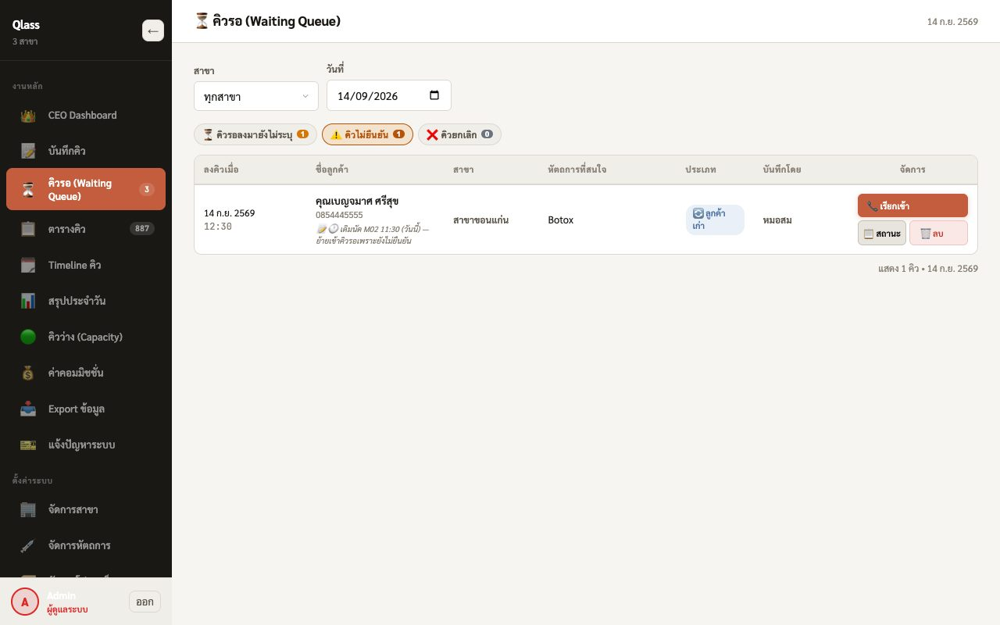
*แท็บ “⚠️ คิวไม่ยืนยัน” หมายเหตุขึ้นต้นด้วย 🕐 เดิมนัด … บอกห้อง/เวลาเดิม*

**เรียกลูกค้าเข้ารับบริการ**

1. กด “📞 เรียกเข้า” ที่แถวของลูกค้า — ระบบพาไปหน้า “บันทึกคิว” ในโหมดแก้ไข พร้อมข้อมูลเดิม
2. เลือกห้องและกดเวลาที่ว่าง (ดูช่องว่างจาก Timeline ก่อนก็ได้)
3. กด “💾 บันทึกการแก้ไข” → ยืนยัน — ถ้าเป็นวันนี้ คิวจะกลายเป็น “ยืนยันแล้ว” ทันที
4. ถ้าบันทึกโดยยังไม่เลือกห้อง ระบบจะเตือน “ยังไม่ได้เลือกห้อง/เวลา — คิวนี้จะยังอยู่ในคิวรอ” และคิวจะยังอยู่ที่เดิม

**เปลี่ยนสถานะโดยไม่ต้องระบุห้อง**

1. กด “📋 สถานะ” — ใช้กรณีลูกค้ายกเลิก, มาทำเสร็จแล้วโดยไม่ได้จองห้องในระบบ ฯลฯ
2. เลือกสถานะ ใส่หมายเหตุ แล้วกด “บันทึกสถานะ” (ในคิวรอจะไม่มีปุ่ม “เลื่อนออก” เพราะยังไม่มีวัน/เวลาให้เลื่อน)

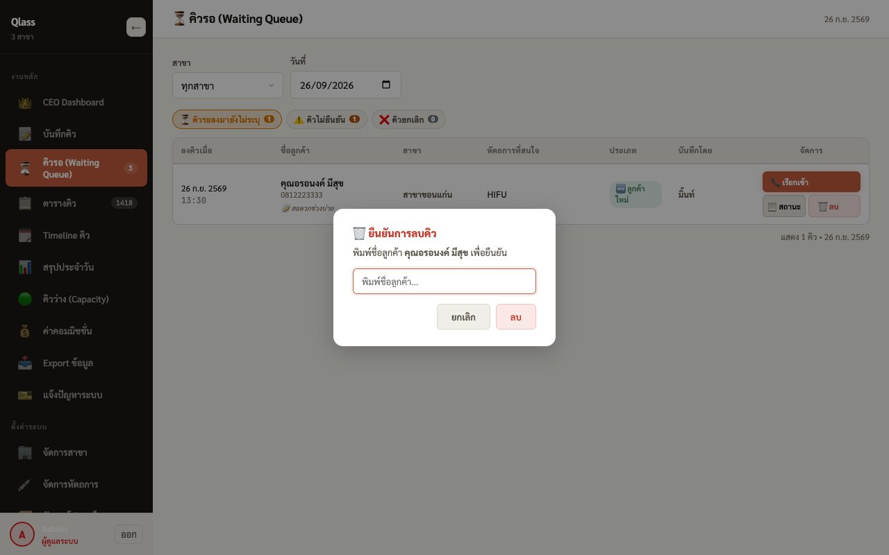
*หน้าต่างลบคิว ต้องพิมพ์ชื่อลูกค้าให้ตรงทุกตัวอักษร ปุ่ม “ลบ” จึงกดได้*

**ลบคิว**

1. กด “🗑️ ลบ” → หน้าต่าง “🗑️ ยืนยันการลบคิว”
2. พิมพ์ชื่อลูกค้าให้ตรงกับที่แสดงทุกตัวอักษร (เว้นวรรคระหว่างคำต้องตรง) ปุ่ม “ลบ” จึงจะกดได้ (กด Enter แทนได้)
3. ระบบจะขึ้น “ลบคิวแล้ว” และบันทึกชื่อผู้ลบไว้ในเมนู “ประวัติการลบ” — ลบแล้วกู้คืนไม่ได้ ถ้าไม่แน่ใจให้เปลี่ยนสถานะเป็น “ยกเลิก” แทน

> 💡 **เคล็ดลับ**
> - ระบบไม่ย้ายคิวเข้าคิวรอให้เอง — คิวที่เลยเที่ยงแล้วยังไม่ยืนยันจะแค่ติดธง “⚠️ เลยเวลายืนยัน” ในตารางคิว/Timeline ต้องกด “➡️ ย้ายเข้าคิวรอ” เองเพื่อปล่อยเวลาให้คนอื่น
> - เลือกวันที่เก่ากว่า 30 วัน ระบบจะโหลดข้อมูลเพิ่มให้ รอแถบ “⏳ กำลังโหลดข้อมูล…” หายก่อน

## 📋 ตารางคิว: ดูและจัดการคิว (รายวันหรือช่วงวันที่)

เมนู: 📋 ตารางคิว  
ใช้ได้กับบทบาท: ผู้ดูแลระบบ · หัวหน้าแอดมิน · แอดมิน · ผู้จัดการสาขา · แคชเชีย

ตารางคิวแยกตามสาขา ดูได้ทั้งแบบวันเดียว (แยกห้อง) และแบบช่วงหลายวัน (แยกวัน) เป็นหน้าหลักสำหรับโทรยืนยัน เปลี่ยนสถานะ แก้ไข และลบคิว (คิวรอจะไม่แสดงในหน้านี้)

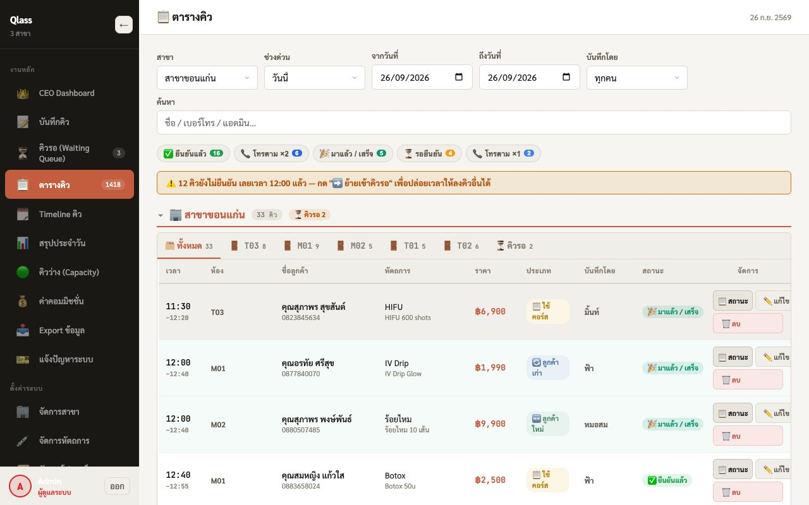
*ตารางคิวแบบวันเดียว: ตัวกรอง สาขา / ช่วงด่วน / จากวันที่ / ถึงวันที่ / บันทึกโดย / ค้นหา, ชิปสถานะ, แถบเตือนคิวเลยเวลา 12:00, แท็บห้อง และปุ่มจัดการรายคิว*

**ตัวกรองด้านบน (6 ช่อง)**

- “สาขา” (เฉพาะบทบาทที่เห็นทุกสาขา)
- “ช่วงด่วน” — เลือกช่วงสำเร็จรูป: วันนี้ / พรุ่งนี้ / เมื่อวาน / 7 วันล่าสุด / สัปดาห์นี้ / ต้นเดือนถึงเมื่อวาน / เดือนนี้ / เดือนที่แล้ว (ถ้าเลือกวันเองจนไม่ตรงกับช่วงไหน จะแสดงเป็น “กำหนดเอง (n วัน)”)
- “จากวันที่” และ “ถึงวันที่” — ค่าเริ่มต้นคือวันนี้ทั้งคู่ (= ดูวันเดียว) เปลี่ยนวันใดวันหนึ่งเพื่อดูช่วงหลายวัน ถ้าใส่วันสลับกันระบบจัดลำดับให้เอง
- “บันทึกโดย” และช่อง “ค้นหา” ชื่อ / เบอร์โทร / ชื่อแอดมิน
- ชิปสถานะใต้ตัวกรอง เช่น “✅ ยืนยันแล้ว 12” — เป็นตัวกรองสถานะเพียงทางเดียวของหน้านี้ กดเพื่อกรอง กดซ้ำเพื่อยกเลิก เลือกได้ทีละ 1 สถานะ (บนมือถือปัดซ้าย-ขวาเพื่อดูชิปที่เหลือ) ตัวเลขบนชิปนับทั้งช่วงที่เลือก ไม่ลดตามช่องค้นหา — คิวที่ “ยังไม่ยืนยัน” ทั้งหมดดูได้จากแถวสีส้มโดยไม่ต้องกดชิป

**โหมดวันเดียว (จากวันที่ = ถึงวันที่)**

- หัวข้อสาขากดพับ/ขยายได้ ถ้าดูหลายสาขาพร้อมกันจะพับไว้ก่อน
- แท็บ “🗂️ ทั้งหมด” / “🚪 ชื่อห้อง” ใช้เลือกดูทีละห้อง เมื่อเลือกห้องเดียวจะเห็นโน้ตของวันนั้น “📅 …” ด้วย
- แถบเตือน “⚠️ n คิวยังไม่ยืนยัน เลยเวลา 12:00 แล้ว …” จะขึ้นเมื่อช่วงที่ดูมีวันนี้อยู่ด้วยและเลยเที่ยงแล้ว

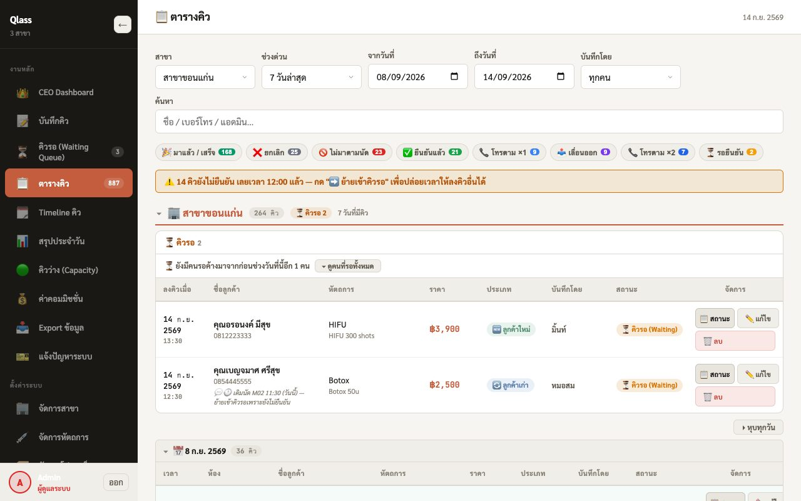
*โหมดช่วงหลายวัน: แต่ละสาขาแสดงเป็นรายวัน (📅 วันที่ + จำนวนคิว) ทุกวันหุบไว้ก่อน กดวันที่เพื่อกาง หรือกด “▾ กางทุกวัน”*

**โหมดช่วงหลายวัน (เช่น กด “เดือนนี้”)**

- แต่ละสาขาจะแสดงเป็นรายวัน หัวข้อ “📅 วันที่ · n คิว” ทุกวันหุบไว้ก่อน กดหัวข้อวันเพื่อกาง/หุบทีละวัน หรือกดปุ่ม “▾ กางทุกวัน” / “▸ หุบทุกวัน” ที่มุมขวาของสาขานั้น
- ข้างชื่อสาขาแสดง “n วันที่มีคิว” (วันที่ไม่มีคิวจะไม่ถูกแสดง) ไม่มีแท็บห้องในโหมดนี้
- ถ้าเลือกช่วงยาวกว่า 7 วันพร้อมกับ “ทุกสาขา” ระบบจะยังไม่แสดงตาราง แต่ขึ้นข้อความ “เลือกสาขาก่อน แล้วถึงจะดูย้อนหลังได้” — ให้เลือกสาขาหรือย่อช่วงให้ไม่เกิน 7 วัน (ผู้จัดการสาขา/แคชเชียไม่เจอข้อความนี้เพราะเห็นสาขาเดียวอยู่แล้ว)
- ช่วงที่มีคิวเกิน 1,500 แถว จะมีแถบ “🐢 n แถว — หน้าอาจหน่วง…” เป็นแค่คำเตือน ข้อมูลยังแสดงครบ
- ท้ายหน้าแสดง “แสดง n คิว • วันเริ่ม – วันสิ้นสุด (n วัน)” ถ้าไม่มีคิวเลยจะขึ้น “ไม่มีคิวในช่วงวันที่เลือก”
- เลือกช่วงที่เก่ากว่า 30 วัน ระบบจะโหลดข้อมูลเพิ่ม รอแถบ “⏳ กำลังโหลดข้อมูล…” ด้านบนหายก่อน ตารางจึงครบ

**อ่านตาราง**

- คอลัมน์ “เวลา” แสดงเวลาเริ่ม และเวลาสิ้นสุด (–15:20) บรรทัดล่าง เรียงตามวันแล้วตามเวลา
- “ชื่อลูกค้า” มีเบอร์และ “💬 หมายเหตุสถานะ” ล่าสุด, “หัตถการ” มีชื่อโปรบรรทัดล่าง
- แถวสีส้มมีขอบซ้าย = “⚠️ เลยเวลายืนยัน” (คิววันนี้ที่ยังไม่ยืนยันหลัง 12:00), แถวเขียวอ่อน = เสร็จแล้ว, แถวจาง = ยกเลิก/ไม่มา
- จำนวนคิวข้างชื่อสาขา/ห้อง/วัน ไม่นับคิวที่ “เลื่อนมา (ใหม่)” เพื่อไม่ให้นับซ้ำกับคิวเดิม

**ปุ่มในคอลัมน์ “จัดการ”**

| ปุ่ม | ใช้เมื่อ | ผลลัพธ์ |
| --- | --- | --- |
| 📋 สถานะ | โทรตาม, ยืนยัน, เลื่อนนัด, ไม่มา, ยกเลิก, เสร็จ | เปิดหน้าต่าง “📋 อัปเดตสถานะคิว” (ดูหัวข้อ “สถานะคิวและการเลื่อนนัด”) |
| ✏️ แก้ไข | แก้ชื่อ/เบอร์/ห้อง/เวลา/หัตถการ/โปร | พาไปหน้าบันทึกคิวในโหมดแก้ไข |
| ➡️ ย้ายเข้าคิวรอ | คิวที่ยังไม่ยืนยัน (รอยืนยัน/โทรตาม) และต้องการปล่อยเวลาให้คนอื่น | หน้าต่างยืนยัน → ห้อง/เวลาถูกปล่อยว่างทันที ข้อมูลเดิมเก็บในหมายเหตุ “🕐 เดิมนัด …” คิวไปอยู่แท็บ “⚠️ คิวไม่ยืนยัน” ในเมนูคิวรอ (ไม่กระทบชื่อผู้บันทึก/ค่าคอม กดได้สบายใจ) |
| 🗑️ ลบ | ลงผิดจริง ๆ และไม่ต้องการเก็บประวัติ | ต้องพิมพ์ชื่อลูกค้ายืนยัน ลบแล้วกู้ไม่ได้ และมีบันทึกชื่อผู้ลบ |

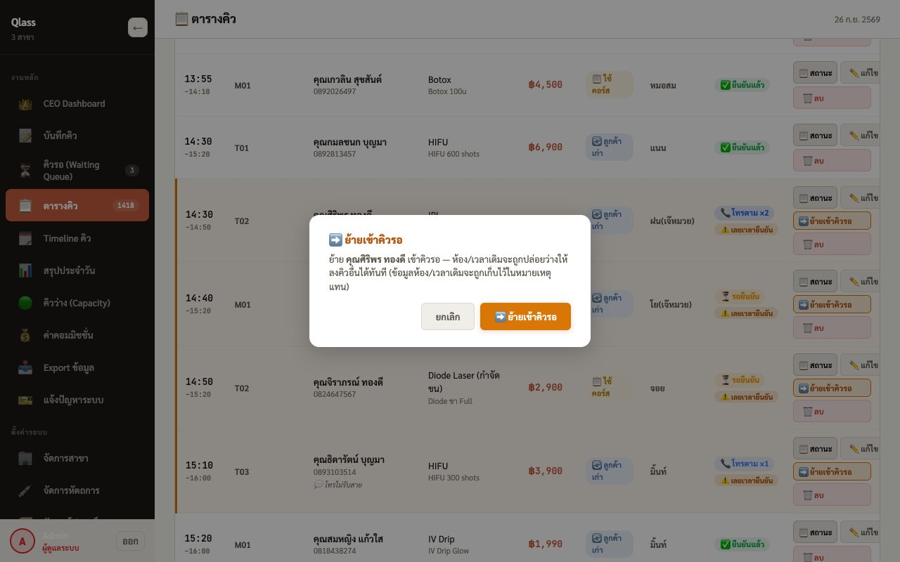
*หน้าต่างยืนยัน “➡️ ย้ายเข้าคิวรอ” — ห้อง/เวลาเดิมจะถูกปล่อยว่างทันที*

> ⚠️ **ข้อควรระวัง**
> - ปุ่ม “➡️ ย้ายเข้าคิวรอ” จะเห็นเฉพาะคิวที่สถานะเป็น รอยืนยัน / โทรตาม ×1–3 และมีห้องอยู่
> - ลบคิว ≠ ยกเลิกคิว — การยกเลิกยังเก็บประวัติไว้ดูในรายงาน ส่วนการลบหายไปจากทุกรายงาน
> - หน้านี้ไม่มีตัวกรอง “เวลา” แล้ว ถ้าอยากรู้ว่า “ตอน 14:00 ใครอยู่ห้องไหน” ให้ดูที่ Timeline

> 💡 **เคล็ดลับ**
> - อยากดูคิวของทั้งเดือนของสาขาตัวเอง: เลือกสาขา → กด “เดือนนี้” → กด “▾ กางทุกวัน”
> - หน้าจออัปเดตเองเมื่อเครื่องอื่นบันทึก ไม่ต้องรีเฟรช

## 🔄 สถานะคิวและการเลื่อนนัด

เมนู: 📋 ตารางคิว  
ใช้ได้กับบทบาท: ผู้ดูแลระบบ · หัวหน้าแอดมิน · แอดมิน · ผู้จัดการสาขา · แคชเชีย

หน้าต่าง “📋 อัปเดตสถานะคิว” เปิดได้จากตารางคิวและคิวรอ ใช้บันทึกผลการโทรตามและสิ่งที่เกิดขึ้นกับคิว

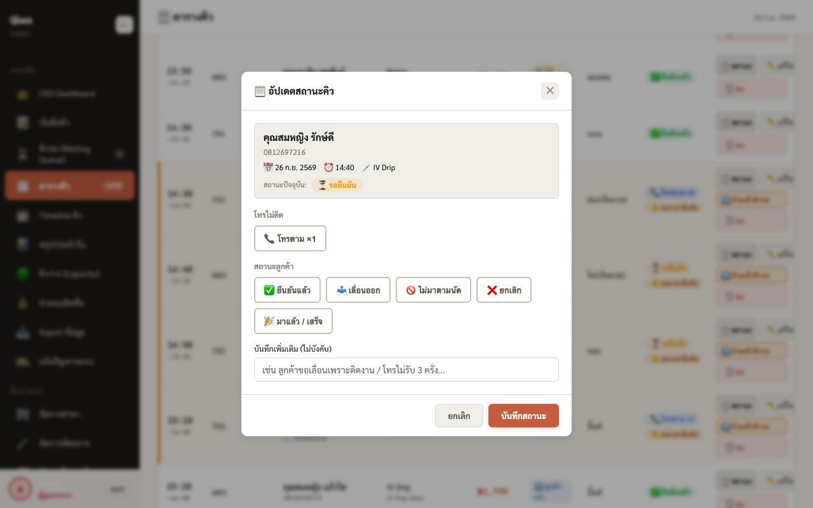
*หน้าต่างอัปเดตสถานะคิว: กลุ่ม “โทรไม่ติด” เสนอครั้งถัดไปให้เอง และกลุ่ม “สถานะลูกค้า”*

**สถานะทั้งหมดและความหมาย**

| สถานะ | ความหมาย | ครองช่องเวลาไหม |
| --- | --- | --- |
| ⏳ รอยืนยัน | ลงคิวล่วงหน้า ยังไม่ได้ติดต่อยืนยัน | ครอง |
| 📞 โทรตาม ×1 / ×2 / ×3 | โทรแล้วไม่ติด ครั้งที่ 1–3 | ครอง |
| ✅ ยืนยันแล้ว | ลูกค้ายืนยันว่าจะมา (คิววันนี้ได้สถานะนี้อัตโนมัติ) | ครอง |
| 🎉 มาแล้ว / เสร็จ | ลูกค้ามารับบริการแล้ว — ใช้คำนวณค่าคอมและรายงานรายได้ | ครอง |
| 📤 เลื่อนออก | คิวเดิมที่ถูกเลื่อนไปวัน/เวลาอื่น (เก็บเป็นประวัติ) | ไม่ครอง — ช่องเดิมว่างให้จองใหม่ |
| 📥 เลื่อนมา (ใหม่) | คิวใหม่ที่ระบบสร้างจากการเลื่อน (เลือกเองไม่ได้) | ครอง |
| 🚫 ไม่มาตามนัด | ถึงเวลาแล้วลูกค้าไม่มา | ไม่ครอง |
| ❌ ยกเลิก | ลูกค้าแจ้งยกเลิก | ไม่ครอง |
| ⏳ คิวรอ (Waiting) | ยังไม่มีห้อง/เวลา (อยู่ในเมนูคิวรอ) | ไม่มีช่อง |

**บันทึกผลโทรตาม / ยืนยัน / เสร็จ**

1. กด “📋 สถานะ” ที่คิว หน้าต่างจะสรุปชื่อ เบอร์ วัน เวลา หัตถการ และ “สถานะปัจจุบัน”
2. โทรไม่ติด → กดปุ่มในกลุ่ม “โทรไม่ติด” ซึ่งมีปุ่มเดียวคือครั้งถัดไป (“📞 โทรตาม ×1” → “×2” → “×3”) ครบ 3 ครั้ง หรือคิวที่ยืนยัน/เสร็จแล้ว จะขึ้นข้อความ “โทรครบ 3 ครั้งแล้ว” แทนปุ่ม
3. ติดต่อได้ → กด “✅ ยืนยันแล้ว”; ลูกค้ามาแล้ว → “🎉 มาแล้ว / เสร็จ”; ไม่มา → “🚫 ไม่มาตามนัด”; ยกเลิก → “❌ ยกเลิก”
4. พิมพ์ “บันทึกเพิ่มเติม” ถ้ามี (เช่น ติดงาน, ขอเลื่อน) แล้วกด “บันทึกสถานะ” — ปุ่มจะกดได้เมื่อเปลี่ยนสถานะหรือพิมพ์หมายเหตุอย่างใดอย่างหนึ่ง

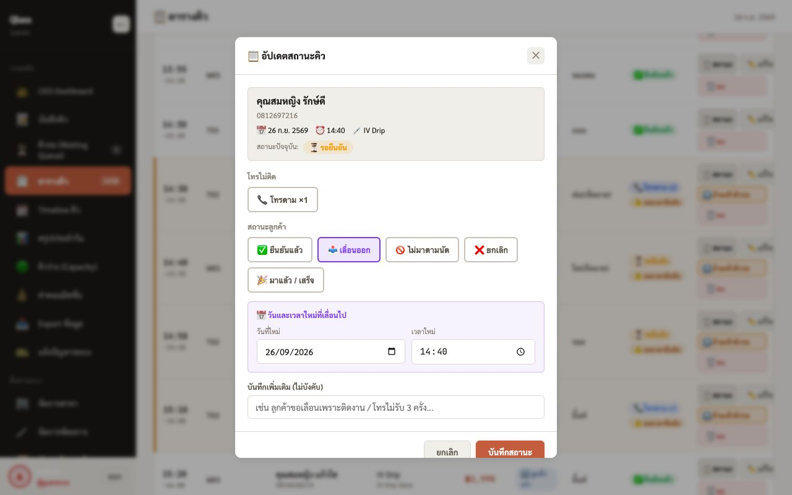
*กด “📤 เลื่อนออก” จะมีช่องวันที่ใหม่และเวลาใหม่ ระบบตรวจวันย้อนหลังและเวลาชนให้*

**เลื่อนนัด (เลื่อนออก)**

1. (แนะนำ) เปิด Timeline ของวันใหม่ดูช่องว่างของห้องเดิมก่อน เพราะกล่องเลื่อนนัดไม่แสดงช่องว่าง
2. กด “📤 เลื่อนออก” จะมีกล่อง “วันและเวลาใหม่ที่เลื่อนไป” ให้กรอก “วันที่ใหม่” (ย้อนหลังไม่ได้) และ “เวลาใหม่” (ขั้นละ 5 นาที) — ช่องจะขึ้นวัน/เวลาเดิมมาให้ ต้องแก้ทั้งสองช่อง
3. ถ้าเวลาใหม่ชนกับคิวอื่นในห้องเดิม ระบบจะเตือน “⚠️ เวลา … ชนกับคิวของ …” ให้เลือกเวลาอื่น
4. กด “บันทึกสถานะ” — ระบบจะ (1) เปลี่ยนคิวเดิมเป็น “เลื่อนออก” และปล่อยช่องเวลาเดิมให้ว่าง (2) สร้างคิวใหม่ที่วัน/เวลาใหม่ สถานะ “เลื่อนมา (ใหม่)” พร้อมข้อมูลลูกค้า ห้อง หัตถการ โปร และชื่อผู้บันทึกเดิม (ค่าคอมยังเป็นของคนลงคิวเดิม)
5. ถ้าไม่กรอกวัน/เวลาใหม่ ระบบจะใช้วัน/เวลาเดิม (คิวใหม่ทับตำแหน่งเดิม) — ควรกรอกทุกครั้ง
6. เลื่อนนัดใช้กับการเปลี่ยน “วัน/เวลา” ในห้องเดิมเท่านั้น ถ้าจะย้ายสาขาหรือย้ายเตียง ให้ใช้ “✏️ แก้ไข” แทน (ดูคำถามที่พบบ่อย)
7. คิวใหม่สถานะ “เลื่อนมา (ใหม่)” ถือว่าลูกค้ายืนยันวันใหม่แล้ว จะไม่ติดธง 12:00 และไม่ต้องโทรยืนยันซ้ำ

> ⚠️ **ข้อควรระวัง**
> - การเปลี่ยนสถานะ (ยกเว้น “เลื่อนออก”) ไม่แตะข้อมูลการจอง (ชื่อ ห้อง เวลา ราคา) ถ้าต้องแก้ชื่อ/เบอร์/ห้อง/โปร ให้ใช้ “✏️ แก้ไข” ส่วนเปลี่ยนวัน/เวลาให้ใช้ “📤 เลื่อนออก” เพื่อให้มีประวัติเลื่อนออก/เลื่อนมา
> - คิวที่ “ยกเลิก / ไม่มา / เลื่อนออก” จะไม่ครองช่องเวลาอีก คนอื่นลงทับได้ทันที ถ้าเปลี่ยนใจให้ลงคิวใหม่
> - ปุ่มโทรตามเดินหน้าอย่างเดียว ย้อนจาก ×2 กลับเป็น ×1 ไม่ได้
> - ค่าคอมมิชชั่นและรายงานรายได้นับเฉพาะสถานะ “มาแล้ว / เสร็จ” — ลืมกดเสร็จ = ค่าคอมไม่ขึ้น

## 🗓️ Timeline คิว: ภาพรวมทุกเตียงและลงคิวด้วยการกด

เมนู: 🗓️ Timeline คิว  
ใช้ได้กับบทบาท: ผู้ดูแลระบบ · หัวหน้าแอดมิน · แอดมิน · ผู้จัดการสาขา · แคชเชีย

ตารางเวลาแนวตั้งของสาขาเดียว 1 วัน แต่ละคอลัมน์คือ 1 เตียง แต่ละแถวคือ 5 นาที เหมาะกับการหาช่องว่างและลงคิวหลายคนเร็ว ๆ

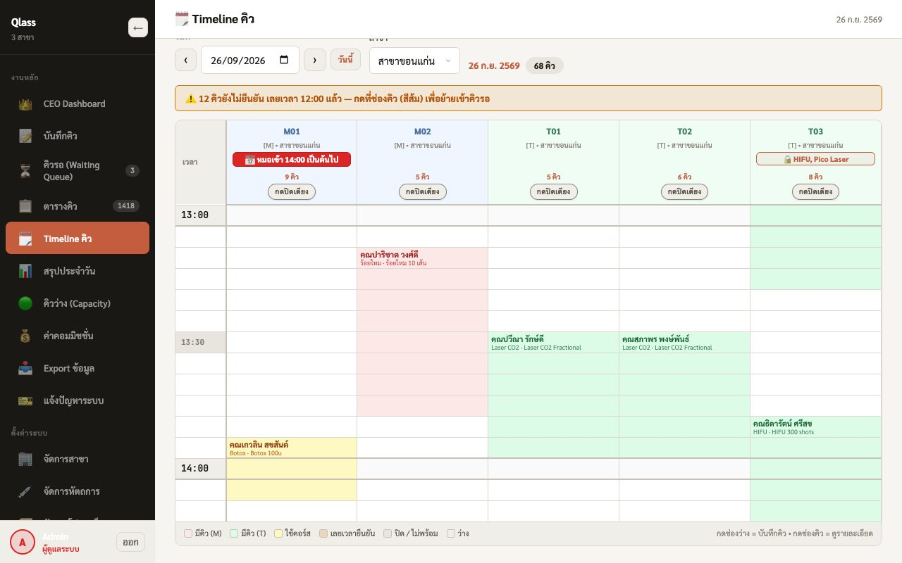
*Timeline: แต่ละคอลัมน์คือ 1 เตียง หัวคอลัมน์มีป้าย 📅 โน้ตวันนั้น / 🔒 หัตถการที่รับ / ปุ่มกดปิดเตียง*

**แถบควบคุม**

- “วันที่”: ปุ่ม ‹ › เลื่อนทีละวัน, ช่องวันที่, ปุ่ม “วันนี้”
- “สาขา”: เลือกได้ทีละสาขา (ไม่มี “ทุกสาขา”) — ผู้จัดการสาขา/แคชเชียเห็นสาขาตัวเองอย่างเดียว
- ป้าย “n คิว” ข้างวันที่ = จำนวนคิวของวันนั้นทั้งหมดที่คุณเห็น (บทบาทที่เห็นทุกสาขาจะได้ยอดรวมทุกสาขา ไม่ใช่เฉพาะสาขาที่เลือก) ส่วน “n คิว” บนหัวคอลัมน์ = คิวของเตียงนั้นรวมที่ยกเลิก/ไม่มาด้วย

**หัวคอลัมน์แต่ละเตียง (บนลงล่าง)**

- ชื่อเตียง (น้ำเงิน = M ห้องฉีด, เขียว = T ห้องเครื่อง) และชื่อสาขา
- ป้าย “🔒 …” = เตียงนี้รับเฉพาะหัตถการที่ระบุ (ตั้งจากจัดการห้อง)
- ป้าย “⛔ ปิดรับคิววันนี้” = เตียงถูกปิดทั้งวัน
- ป้าย “📅 …” = โน้ตของวันนั้นจากตารางห้อง/เครื่อง (เช่น หมอเข้าบ่าย) รวมถึงหมายเหตุของการกดปิดเตียง เช่น “📅 ปิดเตียง (พนักงานหยุด)”
- แถบเตือนด้านบน “⚠️ n คิวยังไม่ยืนยัน เลยเวลา 12:00 แล้ว — กดที่ช่องคิว (สีส้ม) เพื่อย้ายเข้าคิวรอ” — ช่องสีส้ม = เลยเวลายืนยัน (สีเหลือง = ลูกค้าใช้คอร์ส อย่าสับสน)
- ปุ่ม “กดปิดเตียง” / “↩︎ กดเปิดคืน” (ผู้จัดการสาขาขึ้นไป, เฉพาะวันนี้หรือวันในอนาคต) — ดูหัวข้อ “ปิดเตียงรายวัน”

**ความหมายของสีช่อง**

| สี | ความหมาย | กดแล้วเกิดอะไร |
| --- | --- | --- |
| ขาว (ว่าง) | เวลาว่าง ลงคิวได้ | เปิดหน้าต่าง “📝 บันทึกคิว” ย่อ พร้อมห้อง/วัน/เวลาที่กด |
| ชมพู | มีคิว (เตียง M) | เปิดรายละเอียดคิว |
| เขียว | มีคิว (เตียง T) | เปิดรายละเอียดคิว |
| เหลือง | คิวลูกค้าใช้คอร์ส | เปิดรายละเอียดคิว |
| ส้ม | เลยเวลายืนยัน (คิววันนี้ที่ยังไม่ยืนยันหลัง 12:00) | เปิดรายละเอียดคิว มีปุ่มย้ายเข้าคิวรอ |
| เทา (คำว่า “ปิด”) | ห้องปิด/ไม่พร้อม/นอกเวลาเปิด | เตือน “⚠️ ห้องนี้ปิด/ไม่พร้อมในเวลานี้ ไม่สามารถลงคิวได้” |

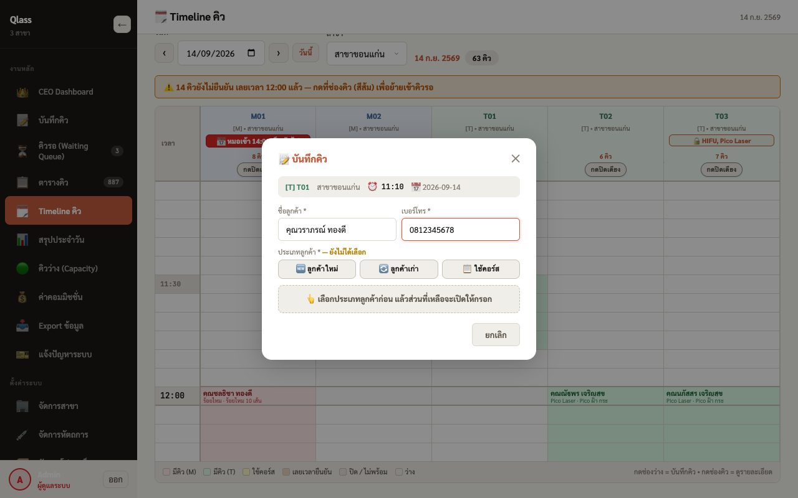
*กดช่องว่างจะได้หน้าต่างลงคิวย่อ ห้อง/วัน/เวลาถูกเติมให้แล้ว*

**ลงคิวจาก Timeline**

1. กดช่องว่างที่เตียงและเวลาที่ต้องการ (ช่องที่กด = เวลาเริ่ม)
2. กรอก “ชื่อลูกค้า *” และ “เบอร์โทร *” (มีค้นหาลูกค้าเก่าใน Pro Clinic เหมือนหน้าบันทึกคิว) ด้านบนฟอร์มจะมีกล่อง “🔒 เตียงนี้ลงได้เฉพาะ: …” และ “📅 โน้ตเตียงนี้วันนี้” ถ้าเตียงนั้นมี
3. เลือก “หัตถการ” (เฉพาะที่เตียงรับ) และ “โปร/แพ็กเกจ” ราคาจะเติมให้ แต่ในหน้าต่างนี้แก้ “ราคา (บาท)” เองได้
4. เลือก “ประเภทลูกค้า” และใส่ “Note” ถ้ามี แล้วกด “✅ บันทึกคิว” — จะขึ้น “บันทึกคิวเรียบร้อย ✓” และช่องนั้นเปลี่ยนสีทันที
5. ถ้ากรอกไปแล้วเผลอกดนอกกรอบ หน้าต่างจะไม่ปิด (ขึ้นข้อความ “ข้อมูลที่กรอกไว้ยังอยู่ครบ…”) ถ้าจะทิ้งให้กด “ยกเลิก”

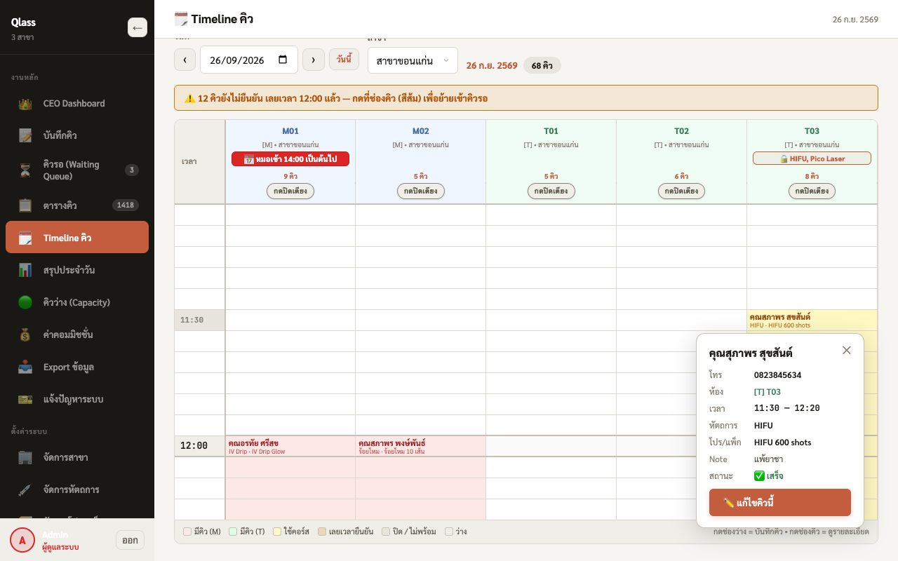
*กดช่องที่มีคิวจะเห็นรายละเอียดและปุ่ม “✏️ แก้ไขคิวนี้” (ปุ่ม “➡️ ย้ายเข้าคิวรอ” จะมีเฉพาะคิวที่ยังไม่ยืนยัน)*

**ดูรายละเอียด / แก้ไข / ย้ายเข้าคิวรอ**

1. กดช่องที่มีคิว → เห็นเบอร์ ห้อง เวลา หัตถการ โปร Note และสถานะแบบย่อ (✅ เสร็จ / ❌ ยกเลิก / ⏳ รอ — สถานะอื่น ๆ เช่นโทรตาม, ยืนยันแล้ว จะแสดงเป็น ⏳ รอ)
2. กด “✏️ แก้ไขคิวนี้” → ไปหน้าบันทึกคิวโหมดแก้ไข
3. กด “➡️ ย้ายเข้าคิวรอ” → ย้ายทันทีโดยไม่มีหน้าต่างยืนยัน (ต่างจากตารางคิว) ช่องเวลาว่างให้คนอื่นทันที
4. เปลี่ยนสถานะละเอียด (โทรตาม/เสร็จ) ต้องไปที่หน้าตารางคิว

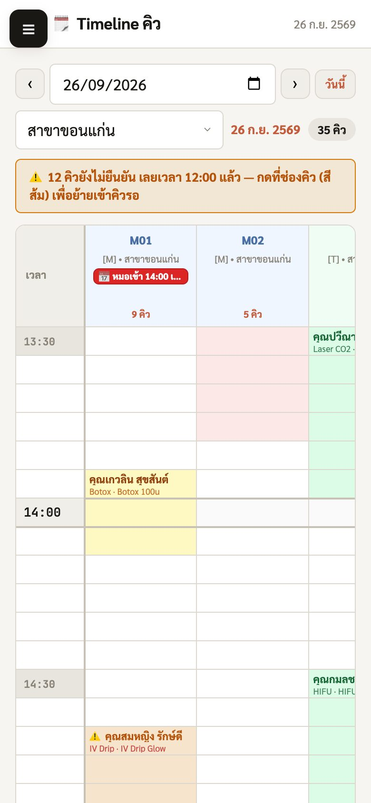
*Timeline บนมือถือ: แถบควบคุม 2 แถว ปัดซ้าย-ขวาเพื่อดูเตียงถัดไป*

> ⚠️ **ข้อควรระวัง**
> - Timeline ตรวจกติกาเตียง (🔒) ทุกครั้ง เพราะเป็นการลงคิวใหม่เสมอ แต่ไม่กันการลงคิวย้อนหลัง — ถ้าเลื่อนไปวันที่ผ่านมาแล้วกดช่องว่าง ระบบจะยอมบันทึก ใช้เฉพาะกรณีตั้งใจบันทึกคิวเก่าที่ตกหล่น
> - โปรที่ปิดใช้แล้วยังอาจโผล่ในหน้าต่างย่อของ Timeline (ต่างจากหน้าบันทึกคิวที่ซ่อน) ให้สังเกตชื่อโปรก่อนเลือก
> - บนมือถือ ถ้าหมุนจอแล้วตารางไม่ปรับ ให้รีเฟรช 1 ครั้ง

## ⛔ ปิดเตียงรายวัน (พนักงานหยุด / เครื่องเสียกะทันหัน)

เมนู: 🗓️ Timeline คิว  
ใช้ได้กับบทบาท: ผู้ดูแลระบบ · หัวหน้าแอดมิน · แอดมิน · ผู้จัดการสาขา

ปุ่มบนหัวคอลัมน์ Timeline สำหรับปิดเตียงเฉพาะวันที่ดูอยู่ด้วยการกดครั้งเดียว — ใช้กับการปิด “1 วัน” (พนักงานหยุดกะทันหัน เครื่องเสียวันนี้/พรุ่งนี้) ถ้าต้องปิดหลายวันหรือปิดล่วงหน้าเป็นแผน ให้ใช้เมนู “ตารางห้อง/เครื่อง” แทน

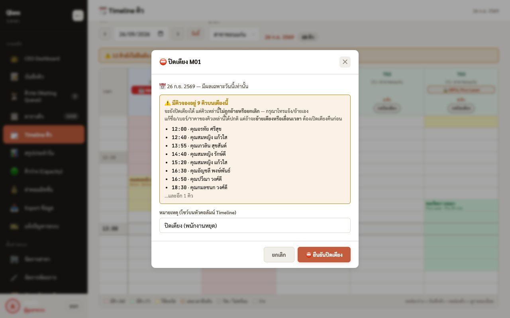
*หน้าต่างปิดเตียง แสดงรายชื่อคิวที่ค้างอยู่บนเตียงให้เห็นก่อนยืนยัน*

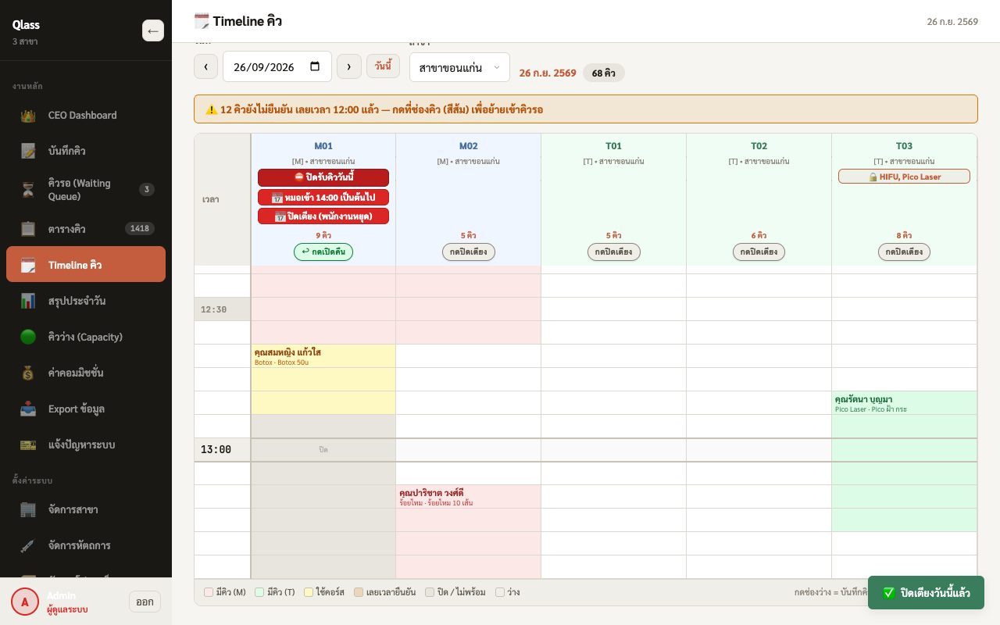
*หลังปิดเตียง: หัวคอลัมน์มีป้าย ⛔ ปิดรับคิววันนี้ ทุกช่องเป็นสีเทา และปุ่มเปลี่ยนเป็น “↩︎ กดเปิดคืน”*

**ปิดเตียง**

1. (ก่อนปิด) เปิดตารางคิว ช่วงด่วน = วันที่จะปิด → แท็บห้องนั้น เพื่อดูรายชื่อคิวที่จองไว้ทั้งหมด (หน้าต่างปิดเตียงแสดงชื่อได้สูงสุด 8 คิว)
2. ที่ Timeline เลือกวันที่ต้องการ (วันนี้หรืออนาคต) แล้วกด “กดปิดเตียง” บนหัวคอลัมน์เตียงนั้น — ระบบจะปิด “วันที่กำลังดูอยู่” แม้ข้อความบนหน้าต่างและปุ่มจะใช้คำว่า “วันนี้”
3. หน้าต่าง “⛔ ปิดเตียง …” จะบอกว่ามีผลเฉพาะวันนี้ และแสดง “⚠️ มีคิวจองอยู่ n คิวบนเตียงนี้” พร้อมรายชื่อ (ถ้ามี) — คิวเหล่านี้ไม่ถูกย้ายหรือยกเลิกให้ ต้องโทรแจ้ง/ย้ายเอง
4. แก้ข้อความ “หมายเหตุ (โชว์บนหัวคอลัมน์ Timeline)” ได้ ค่าเริ่มต้นคือ “ปิดเตียง (พนักงานหยุด)”
5. กด “⛔ ยืนยันปิดเตียง” → ขึ้น “ปิดเตียงวันนี้แล้ว” ทุกช่องของเตียงกลายเป็นสีเทา หัวคอลัมน์มีป้าย “⛔ ปิดรับคิววันนี้” และปุ่มเปลี่ยนเป็น “↩︎ กดเปิดคืน”
6. จัดการคิวที่ค้างบนเตียง (ระบบไม่ทำให้): โทรแจ้งลูกค้า แล้วเลือกทางใดทางหนึ่ง — ย้ายไปเตียงอื่นวันเดิม: กด “✏️ แก้ไข” ที่คิว เปลี่ยนห้อง (ทำได้โดยไม่ต้องเปิดเตียงคืน) / เลื่อนไปวันอื่น: “📋 สถานะ” → “📤 เลื่อนออก” / ลูกค้ายกเลิก: “❌ ยกเลิก” — คิวที่ยังไม่ยืนยันจะกด “➡️ ย้ายเข้าคิวรอ” แล้วค่อยเรียกเข้าภายหลังก็ได้

**เปิดเตียงคืน**

1. กด “↩︎ กดเปิดคืน” บนหัวคอลัมน์ → “🔓 เปิดเตียงคืน” → ขึ้น “เปิดเตียงคืนแล้ว”
2. ปุ่มนี้ลบเฉพาะรายการปิดที่ตัวมันสร้าง ไม่แตะรายการที่คนกรอกไว้ในตารางห้อง/เครื่อง
3. ถ้าเตียงถูกปิดจากหน้าตารางห้อง/เครื่อง (หรือปิดแบบ “ทุกวัน”) จะไม่มีปุ่มเปิดคืน แต่ขึ้นข้อความ “เปิดคืนที่หน้าตารางห้อง/เครื่อง” ให้ไปลบรายการที่นั่น

> ⚠️ **ข้อควรระวัง**
> - ใช้ได้เฉพาะผู้จัดการสาขาขึ้นไป แคชเชียจะเห็นป้าย “⛔ ปิดรับคิววันนี้” แต่ไม่เห็นปุ่ม (ถ้ากดได้จะขึ้น “เฉพาะผู้จัดการสาขาขึ้นไปที่ปิดเตียงได้”)
> - ปิดได้เฉพาะวันนี้หรือวันในอนาคต วันที่ผ่านมาแล้วไม่มีปุ่ม
> - ถ้าสองคนกดปิดพร้อมกัน คนที่ช้ากว่าจะเห็น “มีคนปิดเตียงนี้ไปแล้วเมื่อสักครู่” ถือว่าปิดสำเร็จแล้ว
> - คิวที่ค้างอยู่บนเตียงที่ปิด ยังแก้ชื่อ/เบอร์/ราคาได้ แต่ถ้าจะย้ายเตียงหรือเลื่อนเวลา ต้องเปิดเตียงคืนก่อน หรือแก้จากคิวนั้นให้ไปเตียงอื่น

---

# รายงานและวิเคราะห์

## 📊 สรุปประจำวัน: คิวที่บันทึก vs คิวนัดทำ

เมนู: 📊 สรุปประจำวัน  
ใช้ได้กับบทบาท: CEO · ผู้ดูแลระบบ · หัวหน้าแอดมิน · แอดมิน · ผู้จัดการสาขา · แคชเชีย

หน้านี้มองคิว 2 มุมพร้อมกัน — “คิวที่บันทึก” นับตามวันที่แอดมินลงคิว (ผลงานการปิดการขาย) และ “คิวนัดทำ” นับตามวันนัด (งานที่จะเกิดขึ้นในสาขา)

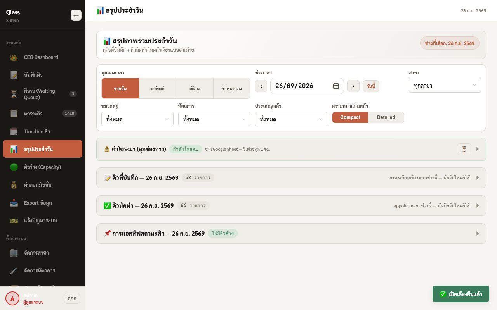
*สรุปประจำวัน: แผงตัวกรอง, การ์ดคิวที่บันทึก (กดแท่งเพื่อกรองไขว้) และการ์ดคิวนัดทำ*

**เลือกช่วงเวลา**

1. “มุมมองเวลา”: รายวัน (ค่าเริ่มต้น) / อาทิตย์ (จันทร์–อาทิตย์) / เดือน / กำหนดเอง
2. ใช้ปุ่ม ‹ › เลื่อนช่วง หรือกดช่องวันที่เพื่อเลือก กด “วันนี้” เพื่อกลับมาปัจจุบัน โหมดกำหนดเองมีช่องเริ่ม–สิ้นสุด
3. ตัวกรองเพิ่มเติม: “สาขา” (เฉพาะบทบาทที่เห็นทุกสาขา), “หมวดหมู่”, “หัตถการ”, “ประเภทลูกค้า” (ทั้งหมด / ลูกใหม่+เก่า / ลูกค้าใหม่ / ลูกค้าเก่า / ใช้คอร์ส)
4. “ความหนาแน่นหน้า”: Compact แสดง 8 แถวต่อกราฟ, Detailed แสดง 14 แถว

**การ์ด “📝 คิวที่บันทึก — ช่วงที่เลือก” (พับไว้ตอนเปิด กดหัวการ์ดเพื่อกาง)**

- นับคิวที่ถูก “ลงในระบบ” ในช่วงนี้ ไม่ว่านัดวันไหน (ไม่นับคิวที่ระบบสร้างจากการเลื่อนนัด)
- ตัวเลข 5 ช่อง: คิวทั้งหมด, มูลค่าโปรที่จอง, ลูกค้าใหม่, ลูกค้าเก่า, ใช้คอร์ส
- แถบ “📌 ในจำนวนนี้ n คิว บันทึกวันนี้แต่นัดวันอื่น (pre-book)” บอกว่ากี่คิวเป็นการจองล่วงหน้า
- กราฟ “📅 คิวไปนัดวันไหนบ้าง” และกราฟแท่งแนวนอน: สาขา (เฉพาะบทบาทที่เห็นทุกสาขา), ผู้บันทึก (ตามบทบาท), ห้อง, หัตถการ, โปร, แอดมิน (บันทึกคิว)
- กดแท่งใดก็ได้เพื่อ “กรองไขว้” เช่น กดชื่อแอดมิน → ทุกกราฟในการ์ดจะเหลือเฉพาะคิวของแอดมินคนนั้น กดหลายแท่งได้ กดชิป “✕” หรือ “✕ Clear all” เพื่อล้าง

**การ์ด “✅ คิวนัดทำ — ช่วงที่เลือก” (กางไว้ตอนเปิด)**

- นับคิวที่ “นัดทำ” ในช่วงนี้ ไม่ว่าลงคิวเมื่อไร
- มีกล่อง “📊 สถานะคิว” บอกจำนวนแต่ละสถานะ และแถบ “📌 … จองล่วงหน้ามาจากวันก่อนหน้า”
- กราฟ สาขา / ห้อง / หัตถการ / โปร (การ์ดนี้กดกรองไขว้ไม่ได้)

**ตัวเลขนี้คิดจากอะไร**

| ตัวเลข | วิธีคิด |
| --- | --- |
| มูลค่าโปรที่จอง | ราคาที่บันทึกในคิว ถ้าคิวไม่มีราคาจะใช้ราคาปัจจุบันของโปรแทน — นับทุกสถานะ (ยังไม่ใช่รายได้จริง) |
| ลูกค้าใหม่ / เก่า / ใช้คอร์ส | นับตาม “ประเภทลูกค้า” ที่เลือกตอนลงคิว |
| ผู้บันทึก (ตามบทบาท) | จัดกลุ่มตามบทบาทของคนที่ลงคิว เช่น แอดมิน, แคชเชีย |
| มูลค่ารายได้จริง | ไม่ได้อยู่หน้านี้ — ดูที่ “ค่าคอมมิชชั่น” หรือ Export ซึ่งนับเฉพาะสถานะ “มาแล้ว/เสร็จ” |

> 💡 **เคล็ดลับ**
> - ผู้ดูแลระบบจะเห็นการ์ด “💰 ค่าโฆษณา (ทุกช่องทาง)” เพิ่ม ดึงจาก Google Sheet ทุก 1 ชั่วโมง กด 🔄 เพื่อรีเฟรชทันที ตัวเลข Est. CPO = ค่าโฆษณา ÷ คิวที่แอดมินบันทึก (ใหม่+เก่า) ทั้งเครือ — การ์ดนี้ไม่เปลี่ยนตามตัวกรองสาขา/หัตถการด้านบน
> - เลือกช่วงที่เก่ากว่า 30 วัน ตัวเลขจะเด้งเพิ่มหลังแถบ “⏳ กำลังโหลดข้อมูล…” หายไป อย่าเพิ่งจดตัวเลขระหว่างโหลด

## 🟢 คิวว่าง (Capacity): สาขาไหนยังรับเพิ่มได้

เมนู: 🟢 คิวว่าง (Capacity)  
ใช้ได้กับบทบาท: CEO · ผู้ดูแลระบบ · หัวหน้าแอดมิน · แอดมิน

แสดงว่าแต่ละสาขายังมีเวลาว่างกี่เปอร์เซ็นต์ในวันข้างหน้า เพื่อวางแผนโปรโมชั่นและกำลังคน

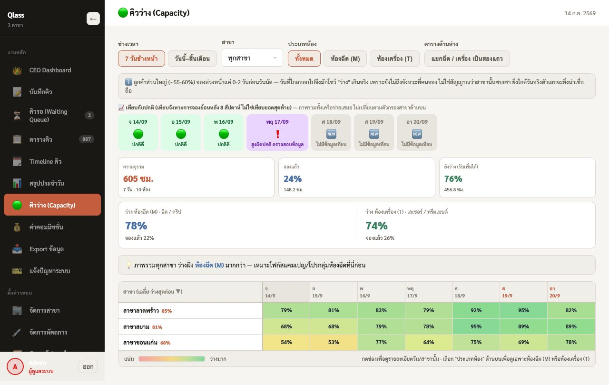
*คิวว่าง: แถบเทียบกับปกติ, การ์ดความจุ/จองแล้ว/ยังว่าง และ Heatmap สาขา × วัน*

**หน้าจอ**

- “ช่วงเวลา”: 7 วันข้างหน้า (ค่าเริ่มต้น) หรือ วันนี้–สิ้นเดือน; “สาขา”: ทุกสาขาหรือเลือกสาขา; ปุ่ม “แยก M/T” ใต้หัวข้อ “ตารางด้านล่าง” แยกแถวห้องฉีด/ห้องเครื่อง (กดแล้วปุ่มเปลี่ยนเป็น “✓ แยก M/T แล้ว”)
- แถบ “📈 เทียบกับปกติ” 7 วัน: 🟢 ปกติดี / 🟡 ต่ำกว่าปกติ / 🔴 ต่ำกว่าปกติมาก / ❗ สูงผิดปกติ ตรวจสอบข้อมูล / 🆕 ไม่มีข้อมูลเทียบ — เทียบ “จังหวะการจอง” กับค่าเฉลี่ย 8 สัปดาห์ย้อนหลังของทั้งเครือ (ไม่เปลี่ยนตามตัวกรองสาขา)
- การ์ด 3 ใบ: ความจุรวม (ชั่วโมงที่ห้องเปิด), จองแล้ว %, ยังว่าง (รับเพิ่มได้) % และการ์ดว่างแยก ห้องฉีด (M) / ห้องเครื่อง (T) ใต้การ์ดมีคำแนะนำ “💡 … ว่างฝั่ง … มากกว่า” บอกว่าควรเน้นโปรกลุ่มไหนก่อน
- ตาราง Heatmap สาขา × วัน: สีแดง = แน่น, สีเขียว = ว่างมาก, “—” = ปิด/ไม่มีห้อง กดหัวคอลัมน์ “สาขา (เฉลี่ย …)” เพื่อสลับเรียงว่างสุด/แน่นสุด
- กดช่องใดช่องหนึ่ง → ป๊อปอัป “📍 สาขา — วันที่” บอกว่าว่างกี่ชั่วโมง แยก M/T และแยกช่วง เช้า (ก่อน 12:00) / บ่าย (12:00–17:00) / เย็น (17:00+) — ป๊อปอัปแสดงภาพรวมทั้งสาขาเสมอ แม้กดจากแถว M หรือ T ในโหมดแยก

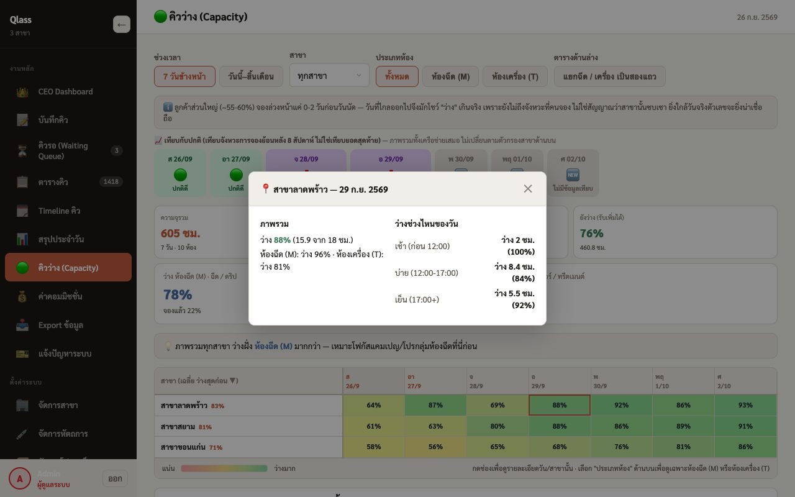
*กดช่องใน Heatmap จะเห็นชั่วโมงว่างแยก M/T และแยกช่วงเช้า/บ่าย/เย็น*

**วิธีคิด**

- ความจุ = เวลาที่ห้องเปิดจริงในวันนั้น (เวลาเปิด-ปิดของห้อง ปรับด้วยตารางห้อง/เครื่อง เช่น ปิดซ่อม ต่อเวลา)
- จองแล้ว = เวลาที่ถูกคิวครอง นับเฉพาะคิวที่ยังมีผล (ไม่นับยกเลิก/ไม่มา/เลื่อนออก)
- ว่าง % = (ความจุ − จองแล้ว) ÷ ความจุ ต่อวัน; ค่าเฉลี่ยรายสาขาคิดจากผลรวมทั้งช่วง

> ⚠️ **ข้อควรระวัง**
> - ลูกค้าส่วนใหญ่จองล่วงหน้าแค่ 0–2 วัน วันไกล ๆ จึงดู “ว่าง” เกินจริง ให้ดูแถบ “เทียบกับปกติ” ประกอบ ไม่ใช่สรุปว่าสาขาซบเซา
> - เข้าหน้านี้ครั้งแรกระบบต้องโหลดข้อมูล 8 สัปดาห์ แถบเทียบกับปกติอาจขึ้น 🆕 ชั่วคราวจนโหลดเสร็จ

## 💰 ค่าคอมมิชชั่น

เมนู: 💰 ค่าคอมมิชชั่น  
ใช้ได้กับบทบาท: ผู้ดูแลระบบ · หัวหน้าแอดมิน · แอดมิน

คำนวณค่าคอมของพนักงานจากคิวสถานะ “มาแล้ว / เสร็จ” ในช่วงวันนัดที่เลือก ค่าคอมเป็นจำนวนเงินคงที่ต่อคิว ตั้งไว้รายคนในเมนูจัดการพนักงาน

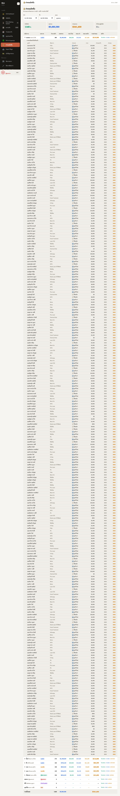
*ค่าคอมมิชชั่น: การ์ดสรุป 4 ใบ ตารางรายพนักงาน และรายละเอียดคิวที่เสร็จเมื่อกดแถว*

**วิธีดู**

1. เลือก “จาก” – “ถึง” (ค่าเริ่มต้นคือวันที่ 1 ของเดือนนี้ถึงวันนี้) และ “สาขา” ถ้าต้องการ
2. อ่านการ์ด 4 ใบ: คิวที่เสร็จ, ยอดรวม (ราคารวมของคิวที่เสร็จของพนักงานที่บัญชียังเปิดอยู่), ค่าคอมรวม, คิวไม่ระบุผู้บันทึก
3. ตารางเรียงพนักงานที่ค่าคอมมากสุดไว้บน (เฉพาะบัญชีที่เปิดใช้งาน) คอลัมน์ “฿/คิว” บอกเรตของแต่ละคน
4. กดแถวพนักงานที่มีคิว (มีลูกศร ▶) เพื่อดู “รายละเอียดคิวที่เสร็จแล้ว” รายคน

**สูตร**

| รายการ | วิธีคิด |
| --- | --- |
| ค่าคอมต่อคิว | เรตของพนักงานตามประเภทลูกค้าของคิวนั้น (ลูกค้าใหม่ / ลูกค้าเก่า / ใช้คอร์ส) — ไม่ใช่เปอร์เซ็นต์ของราคา |
| ใครได้ค่าคอม | คนที่ “บันทึกคิว” (recordedBy) ไม่ใช่คนทำหัตถการ |
| คิวที่นับ | สถานะ “มาแล้ว / เสร็จ” และ “วันนัด” อยู่ในช่วงที่เลือก |
| คิวไม่ระบุผู้บันทึก | คิวที่ไม่มีชื่อผู้บันทึก หรือผู้บันทึกถูกลบออกจากระบบ — ค่าคอมไม่ถูกจ่ายให้ใคร |
| พนักงานที่ถูก “⛔ ปิด” บัญชี | หน้านี้ไม่แสดงคนที่ปิดบัญชีแล้ว และยอดของคนนั้นจะหายจาก “ยอดรวม” และ “ค่าคอมรวม” (แต่ยังนับใน “คิวที่เสร็จ”) — ถ้ายังมีค่าคอมค้างจ่าย ให้ดูจาก Export → “📥 สรุปค่าคอมพนักงาน” ซึ่งยังรวมคนที่ปิดบัญชี |

> 💡 **เคล็ดลับ**
> - แอดมินดูเรตค่าคอมของตัวเองได้ที่คอลัมน์ “฿/คิว” ในหน้านี้ (เมนูจัดการพนักงานที่ตั้งเรตเปิดได้เฉพาะหัวหน้าแอดมินขึ้นไป)
> - แนวปฏิบัติที่แนะนำ: ทีมหน้าสาขาเป็นคนกด “🎉 มาแล้ว / เสร็จ” ก่อนปิดร้านทุกวัน ส่วนแอดมินตรวจย้อนหลัง 2–3 วันด้วยชิป “✅ ยืนยันแล้ว” ในตารางคิว ถ้าวันผ่านไปแล้วยังค้างสถานะนี้ แปลว่ายังไม่มีใครกดเสร็จ

> ⚠️ **ข้อควรระวัง**
> - ตัวเลขจะเปลี่ยนหลังแถบ “⏳ กำลังโหลดข้อมูล…” หายไป (เมื่อเลือกช่วงเก่ากว่า 30 วัน) รอให้โหลดเสร็จก่อนสรุปยอด
> - ต้องการไฟล์ Excel ให้ใช้เมนู Export → “📥 รายละเอียดค่าคอม” หรือ “📥 สรุปค่าคอมพนักงาน” ซึ่งใช้กติกาเดียวกัน

## 📥 Export ข้อมูล: ดาวน์โหลด Excel และสำรองข้อมูล

เมนู: 📥 Export ข้อมูล  
ใช้ได้กับบทบาท: ผู้ดูแลระบบ · หัวหน้าแอดมิน · แอดมิน · ผู้จัดการสาขา · แคชเชีย

ดาวน์โหลดรายงานเป็นไฟล์ .xlsx (เปิดด้วย Excel / Google Sheets ได้ รองรับภาษาไทย) ตามช่วงวันนัดและสาขา

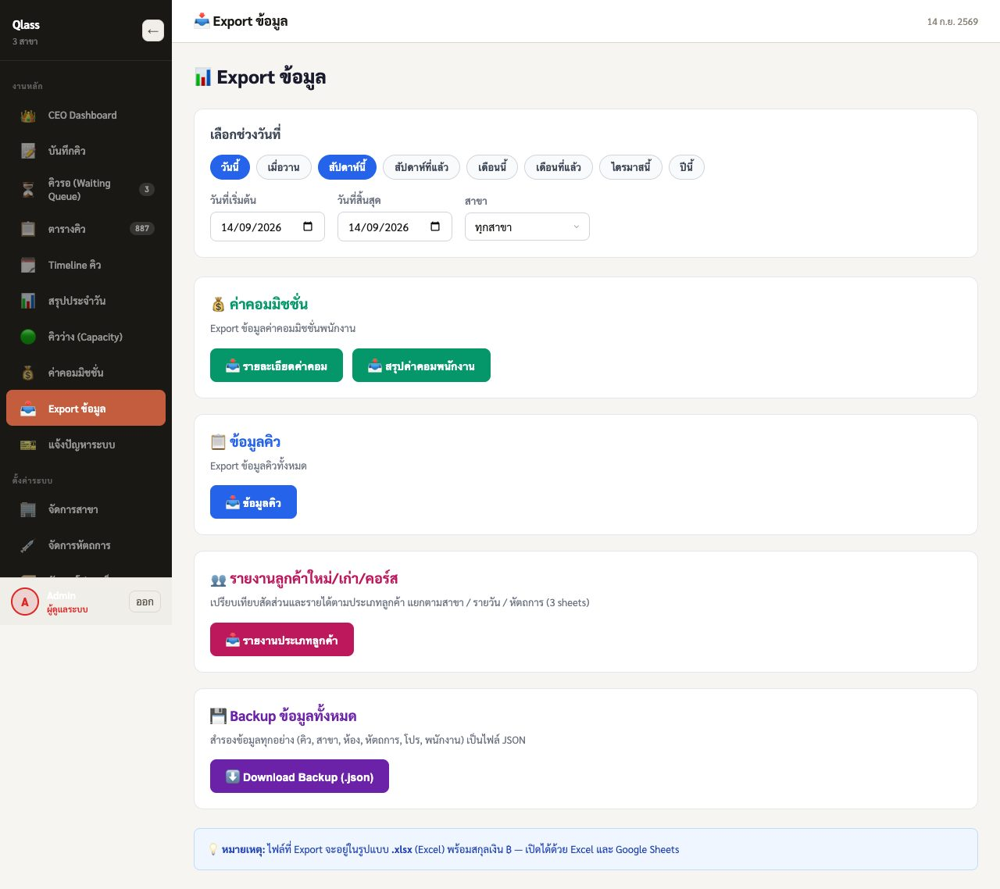
*Export: ปุ่มลัดช่วงวันที่ 8 ปุ่ม และปุ่มดาวน์โหลด 4 รายงาน + Backup*

**วิธีใช้**

1. เลือกช่วงจากปุ่มลัด: วันนี้ / เมื่อวาน / สัปดาห์นี้ / สัปดาห์ที่แล้ว / เดือนนี้ / เดือนที่แล้ว / ไตรมาสนี้ / ปีนี้ หรือกำหนด “วันที่เริ่มต้น” – “วันที่สิ้นสุด” เอง
2. เลือก “สาขา” (ผู้จัดการสาขา/แคชเชียได้เฉพาะสาขาตัวเอง)
3. ถ้าเห็นปุ่มเปลี่ยนเป็น “⏳ กำลังโหลดช่วงที่เลือก…” ให้รอ — ระบบกำลังดึงข้อมูลเก่าเพื่อให้ไฟล์ครบ
4. กดปุ่ม 📥 ที่ต้องการ ไฟล์จะดาวน์โหลดทันที

**ปุ่มและไฟล์ที่ได้**

| ปุ่ม | นับคิวแบบไหน | ชื่อไฟล์ / เนื้อหา |
| --- | --- | --- |
| 📥 รายละเอียดค่าคอม | สถานะเสร็จเท่านั้น | ค่าคอมมิชชั่น_{สาขา}_{เริ่ม}_{สิ้นสุด}.xlsx — รายคิว: วันที่, ลูกค้า, เบอร์, สาขา, หัตถการ, โปร, ประเภท, ราคา, พนักงานบันทึก, ค่าคอม |
| 📥 สรุปค่าคอมพนักงาน | สถานะเสร็จเท่านั้น | สรุปค่าคอมพนักงาน_….xlsx — รายคน: จำนวนคิวใหม่/เก่า/คอร์ส และค่าคอมแต่ละประเภท (เฉพาะคนที่มีคิว) |
| 📥 ข้อมูลคิว | ทุกสถานะ แต่ไม่รวมลูกค้า “ใช้คอร์ส” | ข้อมูลคิว_….xlsx — วันที่, เวลา, ลูกค้า, เบอร์, สาขา, ห้อง, หัตถการ, โปร, ประเภท, ราคา, สถานะ, หมายเหตุ, พนักงานบันทึก |
| 📥 รายงานประเภทลูกค้า | สถานะเสร็จเท่านั้น | รายงานลูกค้า_….xlsx — 3 ชีต: สรุปตามสาขา, รายวัน, ตามหัตถการ (จำนวนและรายได้แยกใหม่/เก่า/คอร์ส) |
| ⬇️ Download Backup (.json) | คิวทั้งหมดทุกช่วงเวลา + สาขา ห้อง หัตถการ โปร พนักงาน | Qlass_backup_{วันเวลา}.json — ไฟล์สำรองสำหรับผู้ดูแลระบบ ไม่ใช่ไฟล์ Excel |

> ⚠️ **ข้อควรระวัง**
> - ปุ่ม “ข้อมูลคิว” ไม่รวมคิวประเภท “ใช้คอร์ส” ถ้าต้องการยอดคอร์สให้ใช้ “รายงานประเภทลูกค้า”
> - รายงานทุกตัวกรองตาม “วันนัด” ไม่ใช่วันที่ลงคิว
> - ปุ่ม Backup โหลดประวัติทั้งหมดซึ่งใช้เวลานาน ถ้าโหลดไม่ครบจะถาม “โหลดประวัติได้ไม่ครบ ต้องการ Backup ต่อด้วยข้อมูลเท่าที่มีหรือไม่?” — แนะนำให้กด Cancel แล้วลองใหม่เมื่อเน็ตเสถียร

## 👑 CEO Dashboard

เมนู: 👑 CEO Dashboard  
ใช้ได้กับบทบาท: CEO · ผู้ดูแลระบบ · หัวหน้าแอดมิน

ภาพรวมทั้งเครือสำหรับผู้บริหาร: แนวโน้มคิว, สาขา/หัตถการที่เติบโตหรือลดลงพร้อมสาเหตุ, ผลงานแอดมิน และประสิทธิภาพโปร (ไม่มีตัวกรองสาขา — ดูทั้งเครือเสมอ)

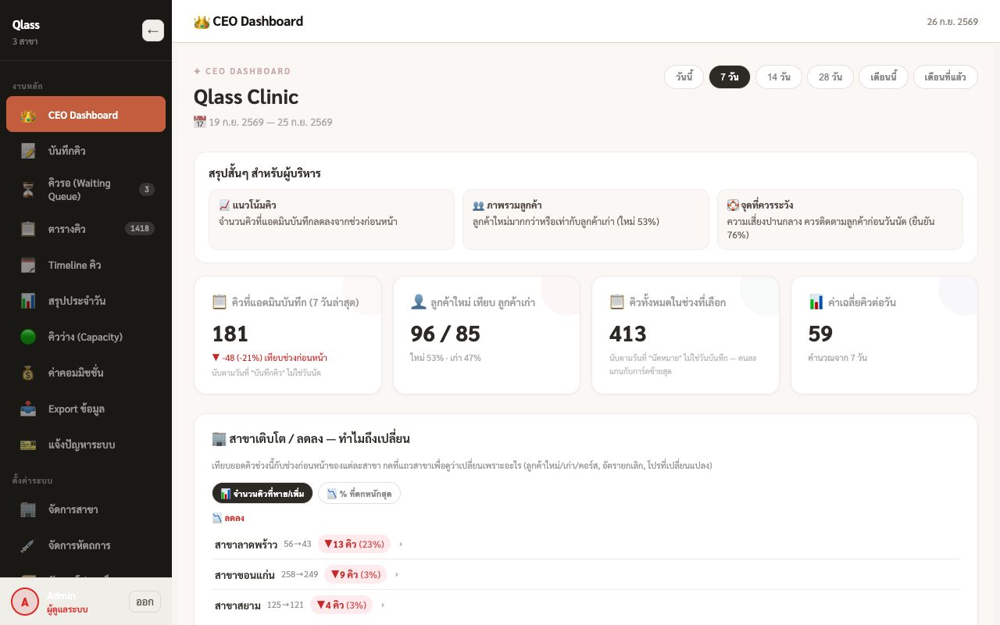
*CEO Dashboard ส่วนบน: สรุปสั้นๆ, การ์ด KPI 4 ใบ และการ์ดสาขา/หัตถการ เติบโต-ลดลง*

**เลือกช่วง**

- ปุ่ม: วันนี้ (ค่าเริ่มต้น) / 7 วัน / 14 วัน / 28 วัน / เดือนนี้ / เดือนที่แล้ว
- โหมด “วันนี้” มีปุ่ม ◀ ▶ เลือกดูวันย้อนหลังได้ (เลือกอนาคตไม่ได้) เมื่อไม่ได้อยู่ที่วันนี้จะมีปุ่ม “กลับวันนี้” โผล่มา
- ทุกโหมดเทียบกับ “ช่วงก่อนหน้า” ที่ยาวเท่ากัน เช่น 7 วัน เทียบกับ 7 วันก่อนหน้านั้น, เดือนนี้ (ถึงวันนี้) เทียบกับเดือนก่อนถึงวันเดียวกัน

**ส่วนบน (เห็นทันที)**

- “สรุปสั้นๆ สำหรับผู้บริหาร” 3 ช่อง: แนวโน้มคิว, ภาพรวมลูกค้า, จุดที่ควรระวัง (อัตราไม่มา/ยกเลิก)
- การ์ด KPI 4 ใบ: “📋 คิวที่แอดมินบันทึก (ช่วง)” นับตามวันที่ลงคิว (ผลงานทีมแอดมิน), “👤 ลูกค้าใหม่ เทียบ ลูกค้าเก่า”, “📋 คิวทั้งหมดในช่วงที่เลือก” นับตามวันนัด และ “📊 ค่าเฉลี่ยคิวต่อวัน” — การ์ดแรกกับการ์ดที่สามคนละแกนเวลา อย่านำมาลบกัน
- การ์ด “🏢 สาขาเติบโต / ลดลง” และ “💉 หัตถการเติบโต / ลดลง”: กลุ่ม “📉 ลดลง” ขึ้นก่อนเสมอ สลับเกณฑ์เรียงได้ระหว่าง “📊 จำนวนคิวที่หาย/เพิ่ม” กับ “📉 % ที่ตกหนักสุด” กดแถวเพื่อดูสาเหตุ: ประเภทลูกค้าที่เปลี่ยน, อัตรายกเลิก/ไม่มา, โปร (หรือสาขา) ที่เปลี่ยนมากสุด
- สาขา/หัตถการที่ช่วงก่อนมีน้อยกว่า 10 คิว จะไม่แสดง % (แสดงจำนวนแทน) เพราะฐานเล็กทำให้ % หลอกตา

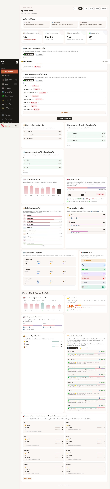
*ส่วนล่างหลังกด “ดูรายละเอียดเพิ่มเติม”: โปรเด่น, แอดมินเด่น, กราฟแนวโน้ม, วิเคราะห์เชิงลึก*

**ส่วนล่าง (กด “▾ ดูรายละเอียดเพิ่มเติม (โปร, แอดมิน, สถิติเชิงลึก)”)**

- โปรเด่น 3 อันดับ / สาขาเด่น–ควรระวัง / แอดมินเด่น–ควรโค้ช (นับเฉพาะคิวที่แอดมินบันทึก ลูกค้าใหม่+เก่า)
- กราฟแนวโน้มรายวัน และ “🧠 สรุปภาพรวมแบบเร็ว” 4 อย่าง (สัดส่วนใหม่/เก่า, ช่วงนี้เทียบช่วงก่อน, วันคิวเยอะ/น้อยสุด, อัตราคอนเฟิร์ม)
- โปรโมชั่นยอดนิยม, ผลงานแอดมิน (🥇🥈🥉), เปรียบเทียบสาขา, สถานะคิว
- “🔬 วิเคราะห์เชิงลึก”: วันไหนคิวเยอะสุด, อัตรายกเลิก/ไม่มา (เขียว ≤13% เหลือง 13–32% แดง >32% เทียบค่าเฉลี่ยเครือ 90 วัน), สัดส่วนลูกค้าใหม่เทียบช่วงก่อน, แอดมินดึงลูกค้าใหม่เก่งสุด, โปรไหนดึงลูกค้าใหม่ได้ดี / เบี้ยวเยอะสุด (ต้องมี ≥10 คิวเสร็จต่อโปร), แอดมิน × หัตถการ

> ⚠️ **ข้อควรระวัง**
> - ตัวเลขที่ระบุว่า “คิวแอดมินเท่านั้น” ไม่รวมลูกค้าใช้คอร์ส และไม่รวมบัญชีการตลาด (PR) 1 บัญชีที่ใช้ลงคิว KOL/Influencer
> - โปรชื่อ “ใช้คอร์ส” ถูกตัดออกจากสถิติโปรทุกจุด
> - ช่วงที่เลือกเก่ากว่า 30 วัน ตัวเลขจะขยับหลังแถบโหลดหาย รอให้เสร็จก่อนอ่าน

## 🎫 แจ้งปัญหาระบบ

เมนู: 🎫 แจ้งปัญหาระบบ  
ใช้ได้กับบทบาท: ผู้ดูแลระบบ · หัวหน้าแอดมิน · แอดมิน · ผู้จัดการสาขา · แคชเชีย

ช่องทางแจ้งบั๊ก ขอฟีเจอร์ หรือสอบถามทีมดูแลระบบ ทุกคนเห็นคำร้องของทุกสาขา

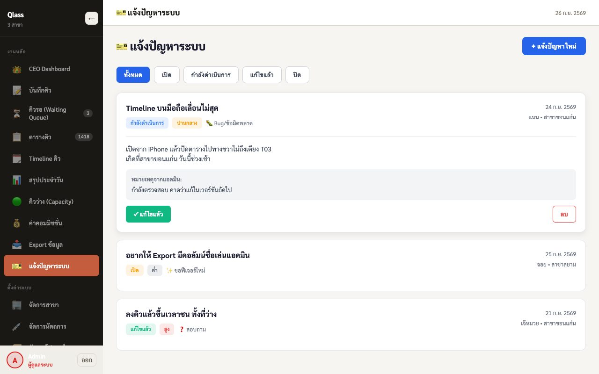
*แจ้งปัญหาระบบ: แท็บสถานะ การ์ดคำร้อง และหมายเหตุจากแอดมิน*

**แจ้งปัญหา**

1. กด “+ แจ้งปัญหาใหม่”
2. กรอก “หัวข้อ” (สรุปสั้น ๆ) และ “รายละเอียด” (ทำอะไร → เห็นอะไร → คาดว่าควรเป็นอะไร ระบุสาขา วันที่ ชื่อลูกค้าที่เกี่ยวข้อง)
3. เลือก “ประเภท”: 🐛 Bug/ข้อผิดพลาด / ✨ ขอฟีเจอร์ใหม่ / ❓ สอบถาม / 📝 อื่นๆ และ “ความสำคัญ”: ต่ำ / ปานกลาง / สูง / เร่งด่วน
4. กด “ส่งคำร้อง” → ขึ้น “ส่งคำร้องเรียบร้อย” คำร้องจะมีสถานะ “เปิด”

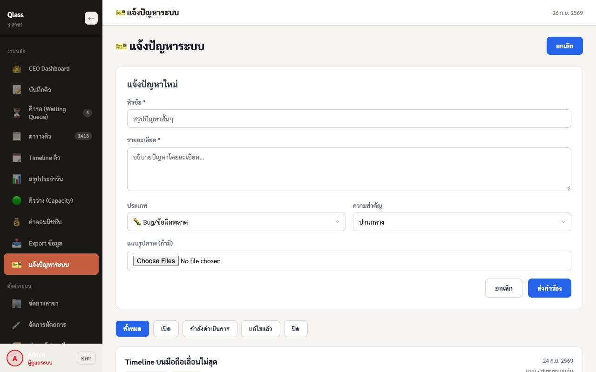
*ฟอร์มแจ้งปัญหาใหม่: หัวข้อ รายละเอียด ประเภท ความสำคัญ*

**ติดตามและจัดการ**

- แท็บ: ทั้งหมด / เปิด / กำลังดำเนินการ / แก้ไขแล้ว / ปิด — กดการ์ดเพื่อดูรายละเอียดและ “หมายเหตุจากแอดมิน” (แท็บ “ปิด” ยังไม่มีปุ่มไหนตั้งสถานะนี้ได้ จึงว่างเสมอในเวอร์ชันนี้)
- ผู้ดูแลระบบ / หัวหน้าแอดมิน มีปุ่ม “✓ แก้ไขแล้ว”, “กำลังดำเนินการ” และ “ลบ” (ถาม “ต้องการลบคำร้องนี้?”) — สถานะเดินหน้าอย่างเดียว: กด “แก้ไขแล้ว” แล้วปุ่มอื่นจะหายไป ย้อนกลับเป็น “เปิด” ไม่ได้
- ผู้จัดการสาขา/แคชเชียเห็นคำร้องของทุกสาขา แต่ชื่อสาขาข้างชื่อผู้แจ้งจะแสดงเฉพาะสาขาตัวเอง

> ⚠️ **ข้อควรระวัง**
> - ช่อง “แนบรูปภาพ” ยังไม่ส่งรูปไปกับคำร้องในเวอร์ชันนี้ ถ้ามีภาพหน้าจอให้ส่งทาง LINE กลุ่มพร้อมระบุหัวข้อคำร้อง
> - ถ้าส่งไม่สำเร็จจะขึ้น “ไม่สามารถสร้างคำร้องได้ ข้อมูลในฟอร์มยังอยู่ครบ กรุณาลองอีกครั้ง” ฟอร์มยังเปิดอยู่ กดส่งซ้ำได้

## 🔍 ประวัติการลบคิว

เมนู: 🔍 ประวัติการลบ  
ใช้ได้กับบทบาท: ผู้ดูแลระบบ · หัวหน้าแอดมิน

บันทึกว่าใครลบคิวไหนเมื่อไร ใช้ตรวจสอบเมื่อคิวหายไปจากตาราง

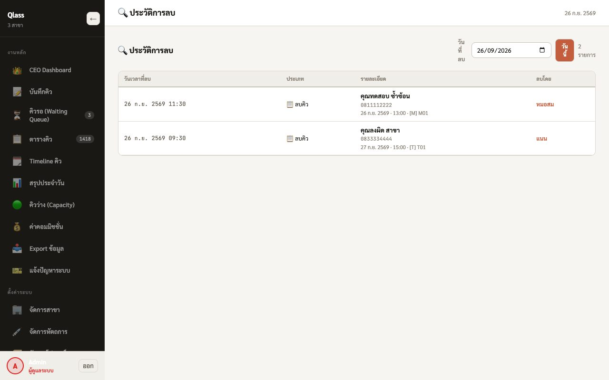
*ประวัติการลบคิว: ใครลบคิวไหนเมื่อไร*

- เลือก “วันที่ลบ” (ค่าเริ่มต้นวันนี้) หรือกด “วันนี้” — แสดงสูงสุด 200 รายการต่อวัน
- คอลัมน์: วันเวลาที่ลบ, ชื่อลูกค้า, เบอร์, วันที่นัด, เวลา, ห้อง, ลบโดย
- หน้านี้บันทึกเฉพาะ “การลบคิว” เท่านั้น ไม่รวมการแก้ไข เปลี่ยนสถานะ หรือการเข้าสู่ระบบ
- ไม่มีปุ่มกู้คืน — ถ้าลบผิดต้องลงคิวใหม่จากข้อมูลในตารางนี้

---

# ตั้งค่าระบบ

## 🏢 จัดการสาขา

เมนู: 🏢 จัดการสาขา  
ใช้ได้กับบทบาท: ผู้ดูแลระบบ

เพิ่ม/แก้ชื่อสาขา สาขาที่สร้างจะไปโผล่ในทุกตัวกรองและใช้ผูกห้อง/พนักงาน

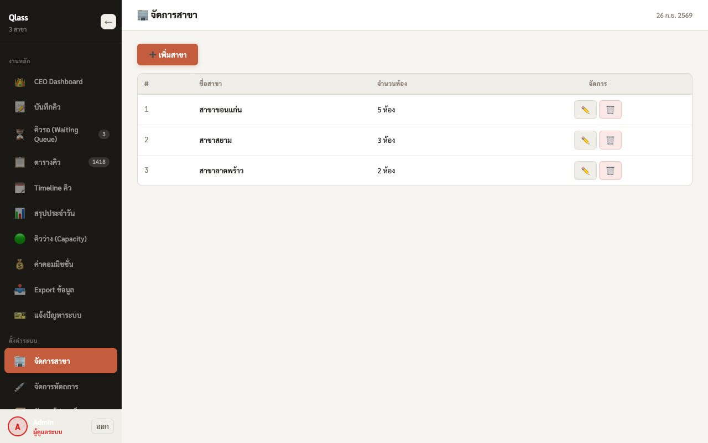
*จัดการสาขา*

1. กด “➕ เพิ่มสาขา” → พิมพ์ “ชื่อสาขา” → “💾 บันทึก” → ขึ้น “บันทึกสาขาเรียบร้อย”
2. กด ✏️ เพื่อแก้ชื่อ, 🗑️ เพื่อลบ (ลบทันทีไม่มีหน้าต่างยืนยัน)
3. คอลัมน์ “จำนวนห้อง” นับจากห้องที่ผูกกับสาขานั้น

> ⚠️ **ข้อควรระวัง**
> - อย่าลบสาขาที่มีห้องหรือคิวอยู่ — ระบบไม่เตือน และถ้าฐานข้อมูลปฏิเสธจะดูเหมือนกดแล้วไม่มีอะไรเกิดขึ้น
> - ชื่อว่างจะบันทึกไม่ได้โดยไม่มีข้อความเตือน และระบบไม่ตรวจชื่อซ้ำ

## 💉 จัดการหัตถการและหมวดหมู่

เมนู: 💉 จัดการหัตถการ  
ใช้ได้กับบทบาท: ผู้ดูแลระบบ · หัวหน้าแอดมิน

กำหนดรายการบริการ ระยะเวลามาตรฐาน และประเภทห้อง (M/T) ที่ใช้ตัดสินว่าลงเตียงไหนได้

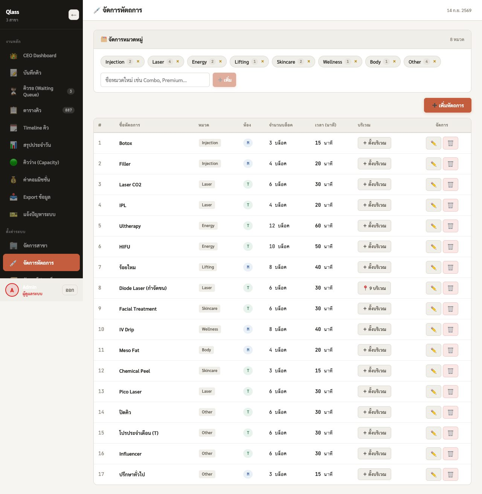
*จัดการหัตถการ: การ์ดหมวดหมู่ และตารางหัตถการพร้อมประเภทห้อง M/T และจำนวนบล็อค*

**เพิ่ม/แก้ไขหัตถการ**

1. กด “➕ เพิ่มหัตถการ”
2. กรอก “ชื่อหัตถการ”, เลือก “หมวดหมู่” (บังคับ), เลือก “ประเภทห้อง”: M ห้องฉีด (Injection / Drip) หรือ T ห้องเครื่อง / ทรีตเมนต์
3. ตั้ง “ระยะเวลา (บล็อคละ 5 นาที)” ด้วยปุ่ม − / + ขั้นละ 5 นาที (ค่าเริ่มต้น 15 นาที, ต่ำสุด 5 นาที, สูงสุด 500 นาที) — ค่านี้คือความยาวคิวมาตรฐานเวลาลงคิว
4. กด “💾 บันทึก” → “บันทึกหัตถการเรียบร้อย”

**จัดการหมวดหมู่ (การ์ด “🗂️ จัดการหมวดหมู่”)**

1. พิมพ์ชื่อหมวดใหม่แล้วกด “➕ เพิ่ม” หรือ Enter (ชื่อที่มีอยู่แล้วจะถูกข้ามเงียบ ๆ ไม่มีข้อความเตือน)
2. กด × ที่ชิปหมวดเพื่อลบ (ลบทันที) หัตถการในหมวดนั้นจะกลายเป็น “ไม่มีหมวด” แต่ไม่หายไป

> ⚠️ **ข้อควรระวัง**
> - ห้ามเปลี่ยนชื่อหัตถการพิเศษ 4 ตัว: “ปิดคิว”, “โปรประจำเดือน (T)”, “Influencer”, “ปรึกษาทั่วไป” — ระบบใช้ชื่อเหล่านี้ให้ลงได้ทุกเตียง เปลี่ยนชื่อแล้วกติกาจะหลุด
> - ประเภทห้อง M/T ของหัตถการคือกติกาที่เตียงที่ “ยังไม่ตั้งค่าล็อก” ใช้ตัดสิน — ตั้งผิดจะทำให้ลงคิวเตียงนั้นไม่ได้ทั้งเครือ
> - ลบหัตถการทำได้ทันทีไม่มีหน้าต่างยืนยัน และไม่เตือนแม้มีคิว/โปรที่ใช้อยู่ — คิวเก่าจะแสดงเป็น “(หัตถการที่ถูกลบแล้ว)” ในรายงาน

## 🏷️ จัดการโปร/แพ็กเกจ

เมนู: 🏷️ จัดการโปร/แพ็กเกจ  
ใช้ได้กับบทบาท: ผู้ดูแลระบบ · หัวหน้าแอดมิน

โปรคือสิ่งที่กำหนดราคาในคิว โปรที่ “เปิดใช้” จะโผล่ให้เลือกในหน้าบันทึกคิว

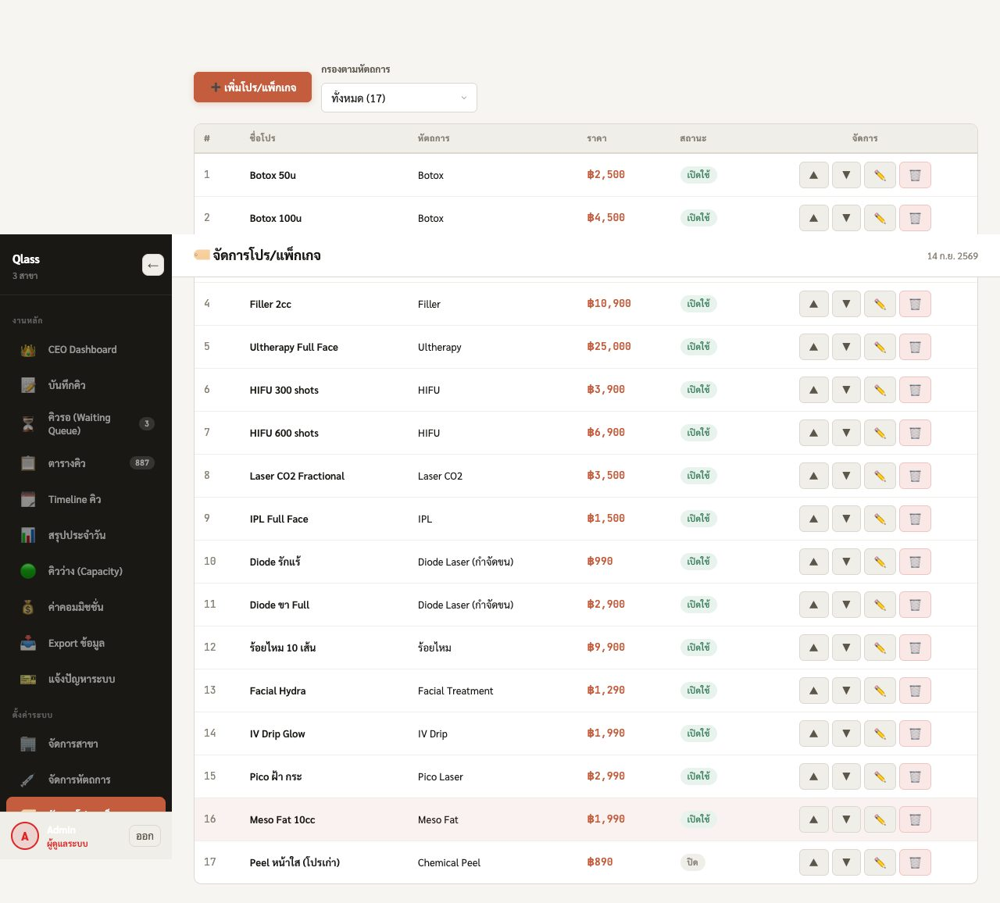
*จัดการโปร/แพ็กเกจ: ตัวกรองตามหัตถการ ราคา สถานะ และปุ่มจัดลำดับ ▲▼*

1. กด “➕ เพิ่มโปร/แพ็กเกจ” (หน้าต่างชื่อ “➕ เพิ่มโปร”) → กรอก “ชื่อโปร/แพ็กเกจ”, เลือก “หัตถการ” ที่ผูก (ควรเลือกทุกครั้ง — ถ้าไม่เลือก โปรจะไปโผล่กับทุกหัตถการในหน้าต่างลงคิวย่อของ Timeline), ใส่ “ราคา (บาท)” เป็นจำนวนเต็ม, เลือก “✅ เปิดใช้” หรือ “⛔ ปิด” → “💾 บันทึก”
2. ใช้ตัวกรอง “กรองตามหัตถการ” เพื่อดูโปรของหัตถการเดียว
3. ปุ่ม ▲ ▼ จัดลำดับการแสดงผล — ต้องจัดตอนตัวกรองเป็น “ทั้งหมด” เท่านั้น ถ้ากดขณะกรองหัตถการอยู่ ระบบจะสลับกับโปรที่ซ่อนอยู่ ทำให้ลำดับที่เห็นไม่ขยับ
4. โปรที่หมดอายุให้ตั้งเป็น “⛔ ปิด” แทนการลบ เพื่อให้รายงานเก่ายังอ่านชื่อโปรได้

> ⚠️ **ข้อควรระวัง**
> - ลบโปรทำได้ทันทีไม่มีหน้าต่างยืนยัน
> - ราคาที่พิมพ์ไม่ใช่ตัวเลขจะกลายเป็น 0
> - หน้าต่างลงคิวย่อของ Timeline ยังแสดงโปรที่ปิดแล้วด้วย (ต่างจากหน้าบันทึกคิวที่ซ่อน) เวลาลงคิวจาก Timeline ให้ดูชื่อโปรก่อนเลือก

## 🚪 จัดการห้อง/เตียง และล็อกหัตถการรายเตียง

เมนู: 🚪 จัดการห้อง  
ใช้ได้กับบทบาท: ผู้ดูแลระบบ · หัวหน้าแอดมิน · ผู้จัดการสาขา

“ห้อง” ในระบบคือ 1 เตียงพร้อมคนทำ ตั้งประเภท M/T เวลาเปิด-ปิดปกติ และ (ถ้าต้องการ) ล็อกว่าเตียงนี้รับหัตถการอะไรได้บ้าง ผู้จัดการสาขาจัดการได้เฉพาะสาขาตัวเอง

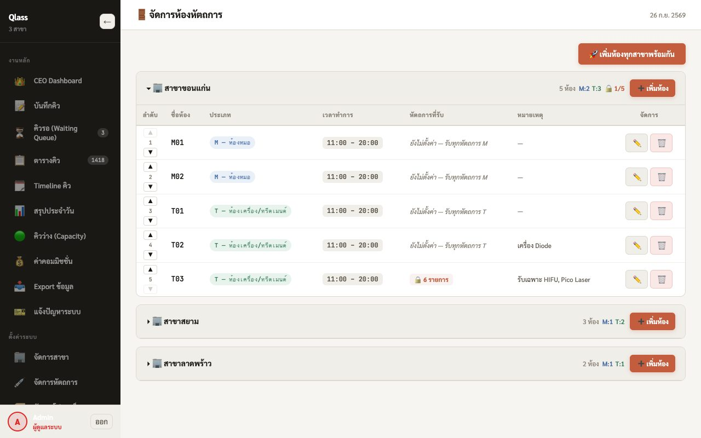
*จัดการห้อง: การ์ดต่อสาขา คอลัมน์ “หัตถการที่รับ” บอกว่าเตียงล็อกแล้ว (🔒) หรือยังไม่ตั้งค่า*

**หน้าจอ**

- การ์ดต่อสาขา (กดหัวการ์ดเพื่อกาง) แสดงจำนวนห้อง, M:, T:, “🔒 n/m” (เตียงที่ล็อกแล้ว) และ “⚠️ n” (หัตถการที่ไม่มีเตียงไหนรับ)
- ตาราง: ลำดับ (▲▼), ชื่อห้อง, ประเภท (M — ห้องหมอ / T — ห้องเครื่อง/ทรีตเมนต์), เวลาทำการ, หัตถการที่รับ (“ยังไม่ตั้งค่า — รับทุกหัตถการ M/T” หรือ “🔒 n รายการ”), หมายเหตุ, จัดการ
- ปุ่ม “🚀 เพิ่มห้องทุกสาขาพร้อมกัน” สร้างเตียงประเภทเดียวกันให้หลายสาขาในครั้งเดียว (ขึ้น “สร้าง n ห้องเรียบร้อย 🚀”)

**เพิ่มเตียง**

1. กด “➕ เพิ่มห้อง” ในการ์ดสาขา (หรือปุ่ม 🚀 แล้วติ๊กสาขา)
2. เลือก “ประเภทห้อง” M หรือ T — ชื่อห้องระบบตั้งให้เอง เช่น M01, T03 นับจากจำนวนเตียงประเภทนั้นในสาขา (แก้ชื่อไม่ได้ และเปลี่ยนสาขา/ประเภทหลังสร้างไม่ได้; ถ้าเคยลบเตียงกลางไป ชื่อใหม่อาจซ้ำกับที่มีอยู่ ให้ตรวจก่อนบันทึก)
3. ตั้ง “⏰ เวลาเปิด-ปิดเริ่มต้น” ขั้นละ 30 นาที ระหว่าง 11:00–20:00 (วันพิเศษให้ใช้ตารางห้อง/เครื่อง)
4. ใส่ “หมายเหตุ” เช่น ห้องนี้มีเครื่อง HIFU ด้วย → “💾 บันทึก”

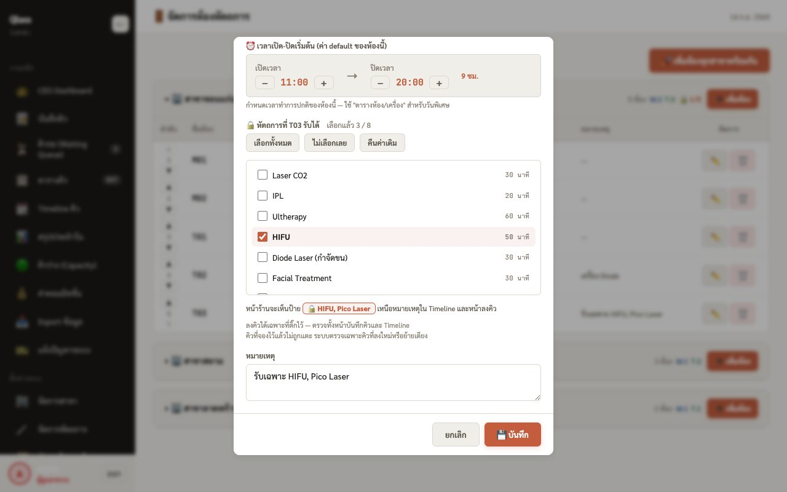
*หน้าต่างแก้ไขห้อง เลื่อนลงจะเห็นกล่อง “🔒 หัตถการที่ … รับได้” ให้ติ๊ก*

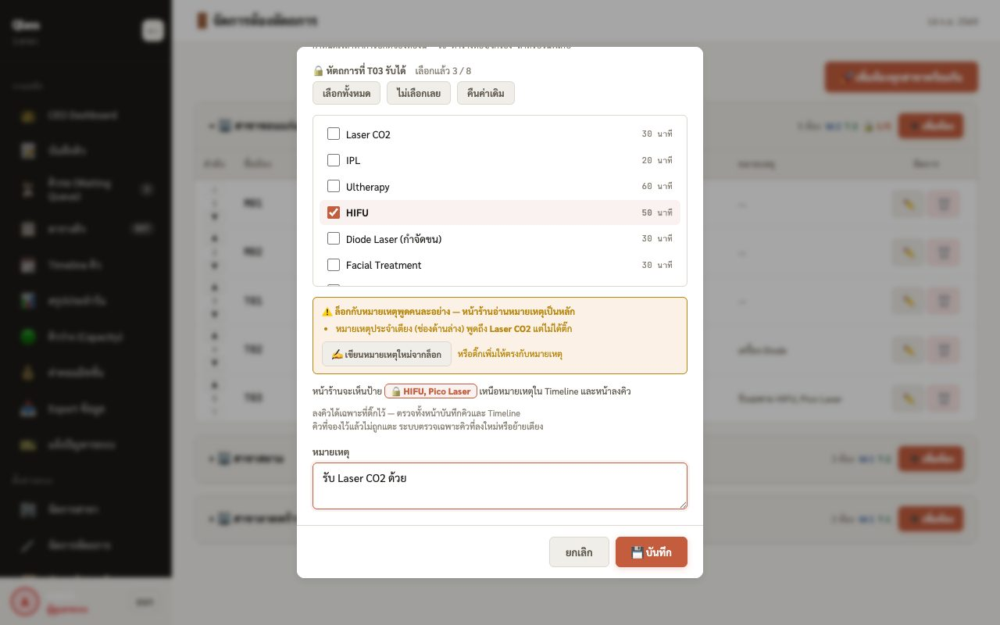
*ถ้าหมายเหตุเอ่ยถึงหัตถการที่ไม่ได้ติ๊ก จะขึ้นกล่องเหลือง “⚠️ ล็อกกับหมายเหตุพูดคนละอย่าง” พร้อมปุ่ม “✍️ เขียนหมายเหตุใหม่จากล็อก”*

**ล็อกหัตถการที่เตียงรับ (🔒) — ทำได้ตอน “✏️ แก้ไข” เท่านั้น**

1. กด ✏️ ที่เตียง → เลื่อนไปกล่อง “🔒 หัตถการที่ {ชื่อเตียง} รับได้”
2. ติ๊กเฉพาะหัตถการที่เตียงนี้มีเครื่อง/ทำได้ — ทุกตัวที่ “ไม่ติ๊ก” จะลงคิวบนเตียงนี้ไม่ได้ทันทีหลังบันทึก (รายการแสดงเฉพาะฝั่ง M หรือ T เดียวกับเตียง ต้องเลื่อนดูให้ครบ) พอติ๊กตัวแรก หัตถการพิเศษที่มีป้าย “ทุกเตียง” จะถูกติ๊กให้เองและเอาออกไม่ได้ มีปุ่มช่วย “เลือกทั้งหมด” / “ไม่เลือกเลย” / “คืนค่าเดิม” ส่วนตัวนับ “เลือกแล้ว n / m” นับรวมตัวที่ระบบติ๊กให้ ให้ยึดป้ายพรีวิวเป็นหลัก
3. ดูบรรทัด “หน้าร้านจะเห็นป้าย 🔒 …” ว่าป้ายบน Timeline จะเขียนว่าอะไร
4. ถ้าขึ้นกล่องเหลือง “⚠️ ล็อกกับหมายเหตุพูดคนละอย่าง” แปลว่าหมายเหตุประจำเตียงหรือโน้ตรายวันเอ่ยถึงหัตถการที่ไม่ได้ติ๊ก — กด “✍️ เขียนหมายเหตุใหม่จากล็อก” หรือติ๊กเพิ่มให้ตรงกัน
5. กด “💾 บันทึก” → “บันทึกห้องเรียบร้อย” — ตารางจะแสดง “🔒 n รายการ” และ Timeline/บันทึกคิวจะบังคับทันทีสำหรับคิวใหม่
6. หลังล็อก ให้เปิดตารางคิว (ช่วงด่วน “7 วันล่าสุด” หรือช่วงข้างหน้า → แท็บห้องนั้น) ดูว่ามีคิวหัตถการที่ไม่ได้ติ๊กจองค้างอยู่ไหม ระบบไม่ย้ายคิวเก่าให้ ต้องกด “✏️ แก้ไข” ย้ายไปเตียงที่รับได้เอง
7. ต้องการยกเลิกล็อก: กด “ไม่เลือกเลย” แล้วบันทึก จะขึ้น “⚠️ ไม่เลือกเลย = ล้างการตั้งค่าเตียงนี้ กลับไปรับทุกหัตถการประเภท …” ซึ่งเป็นสิ่งที่ต้องการ

**กติกาของล็อกที่ต้องเข้าใจ**

- เตียงที่ “ยังไม่ตั้งค่า” = รับทุกหัตถการที่ประเภท M/T ตรงกัน (พฤติกรรมเดิม) ไม่ใช่ “ห้ามทุกอย่าง”
- เตียงที่ตั้งค่าแล้ว = รับเฉพาะที่ติ๊ก ทั้งสองทาง (เตียง Pico ไม่รับ Diode และเตียง Diode ไม่รับ Pico)
- ระบบตรวจเฉพาะ “คิวใหม่” และ “การย้ายเตียง/เปลี่ยนหัตถการ” — คิวที่จองไว้แล้วไม่ถูกแตะ
- ถ้าติ๊กจนหัตถการใดไม่มีเตียงไหนในสาขารับเลย จะขึ้น “⚠️ สาขานี้ยังไม่มีเตียงไหนรับ: …” ในการ์ดสาขา — หัตถการนั้นจะลงคิวที่สาขานี้ไม่ได้เลย ต้องแก้ทันที
- ทีมสาขาเป็นคนตัดสินว่าเตียงไหนมีเครื่องอะไร อย่าเดาจากประวัติการจอง

> ⚠️ **ข้อควรระวัง**
> - ลบเตียงทำได้ทันทีไม่มีหน้าต่างยืนยัน และคิวเก่าบนเตียงนั้นจะแสดงห้องเป็น “—”
> - ปุ่ม ▲▼ จัดลำดับได้เฉพาะภายในสาขาเดียวกัน และไม่มีข้อความยืนยัน
> - ถ้าขึ้น “ระบบล็อกเตียงยังไม่เปิดใช้ (ยังไม่ได้รัน migration room_procedures) — ยังไม่ได้บันทึกอะไร” แปลว่าฐานข้อมูลยังไม่พร้อมใช้ฟีเจอร์นี้ ให้แจ้งผู้ดูแลระบบ

## 📅 ตารางห้อง/เครื่อง: วันพิเศษ ปิดซ่อม ต่อเวลา และโน้ตรายวัน

เมนู: 📅 ตารางห้อง/เครื่อง  
ใช้ได้กับบทบาท: ผู้ดูแลระบบ · หัวหน้าแอดมิน · แอดมิน · ผู้จัดการสาขา

ใช้บอกระบบว่าวันไหนห้อง/เครื่องไม่พร้อม เปิดพิเศษ หรือมีข้อความที่หน้าร้านต้องเห็น เช่น เครื่อง HIFU ส่งซ่อม, หมอเข้าเฉพาะบ่าย

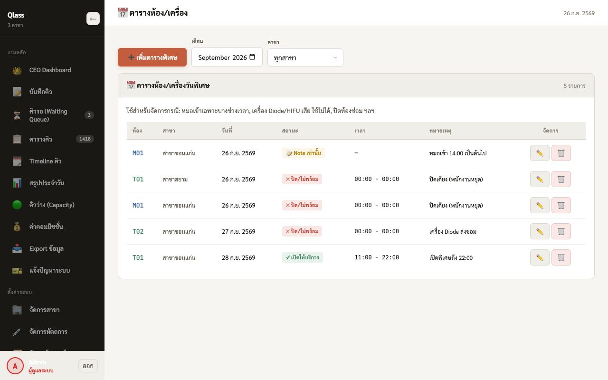
*ตารางห้อง/เครื่อง: ตัวกรองเดือน/สาขา และรายการวันพิเศษพร้อมสถานะ 3 แบบ*

**หน้าจอ**

- ตัวกรอง “เดือน” (ค่าเริ่มต้นเดือนนี้) และ “สาขา” ปุ่ม “รีเซ็ต” จะขึ้นเมื่อเปลี่ยนตัวกรอง
- ตาราง: ห้อง, สาขา, วันที่ (รายการเก่าบางรายการแสดง “ทุกวัน” = ใช้ทุกวัน), สถานะ (✕ ปิด/ไม่พร้อม, ✓ เปิดให้บริการ, 📝 Note เท่านั้น), เวลา (รายการปิดทั้งวันแสดง 00:00 - 00:00, Note เท่านั้นแสดง —), หมายเหตุ, จัดการ
- แสดงทีละ 50 รายการ กด “โหลดเพิ่ม — เหลืออีก n รายการ” เพื่อดูต่อ

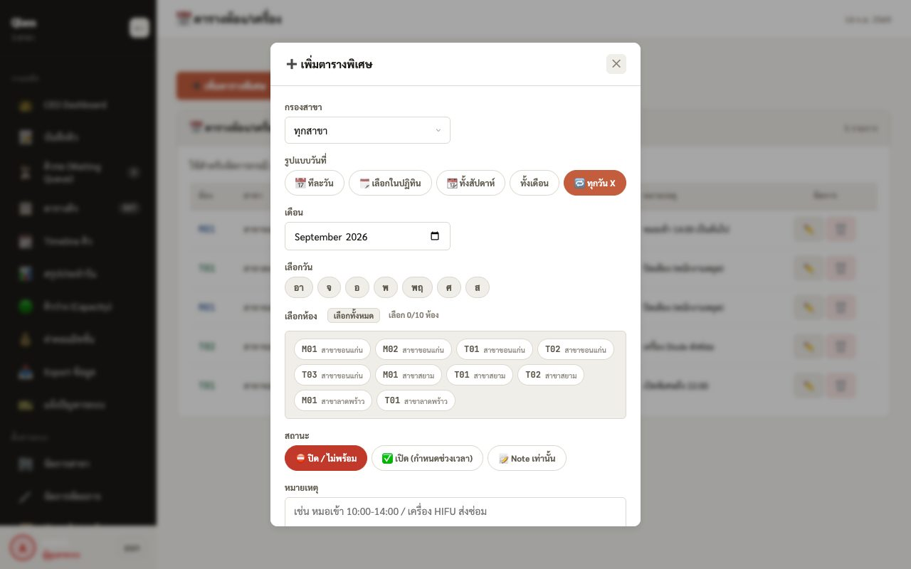
*หน้าต่างเพิ่มตารางพิเศษ: รูปแบบวันที่ 5 แบบ เลือกหลายห้อง และสถานะ ปิด / เปิด / Note เท่านั้น*

**เพิ่มรายการพิเศษ**

1. กด “➕ เพิ่มตารางพิเศษ”
2. เลือก “รูปแบบวันที่”: 📅 ทีละวัน / 🗓 เลือกในปฏิทิน (กดหลายวัน) / 📆 ทั้งสัปดาห์ (จันทร์–อาทิตย์ของวันที่เลือก) / ทั้งเดือน / 🔁 ทุกวัน X (เช่น ทุกจันทร์กับพุธ) — แบบทั้งเดือนและทุกวัน X ต้องตั้งช่อง “เดือน” ในหน้าต่างด้วย (ค่าเริ่มต้นคือเดือนนี้) ระบบจะบอกจำนวนวันที่จะสร้าง เช่น “จะสร้าง 9 วัน ทุกวันจันทร์, พุธ ในเดือนที่เลือก”
3. เลือกสาขาใน “กรองสาขา” (อยู่บนสุดของหน้าต่าง) แล้วกดเลือกห้อง (กดได้หลายห้อง หรือ “เลือกทั้งหมด”) — ระบบผูกกับ “เตียง” ไม่ใช่ “เครื่อง” ถ้าเครื่องเสียแต่เตียงยังทำหัตถการอื่นได้ ให้ใช้ “📝 Note เท่านั้น” บอกทีม แทนการปิดทั้งเตียง
4. เลือก “สถานะ” — ดูตารางด้านล่าง
5. ใส่ “หมายเหตุ” (จะโชว์บนหัวคอลัมน์ Timeline และใต้ช่องห้องในหน้าบันทึกคิว) แล้วกดปุ่มบันทึก — ถ้าหลายวันปุ่มจะบอกจำนวน เช่น “💾 บันทึก (3 วัน × 2 ห้อง = 6 รายการ)”, หลายห้องวันเดียว “💾 บันทึก (2 ห้อง)” → “เพิ่มตาราง n รายการเรียบร้อย 🗓️”
6. หน้าต่างนี้ไม่เตือนเรื่องคิวที่จองไว้แล้ว — ก่อนปิดหลายวัน ให้เปิดตารางคิวช่วงนั้น (เลือกสาขา + ช่วงวันที่) ดูคิวที่ต้องโทรแจ้ง/ย้ายเอง
7. บันทึกเสร็จ ถ้าเป็นเดือนหน้า ตารางในหน้านี้จะยังว่าง เพราะตัวกรอง “เดือน” ตั้งเป็นเดือนนี้ ให้เปลี่ยนเดือนเพื่อดูรายการที่เพิ่งสร้าง (ไม่ต้องกดซ้ำ)

**สถานะ 3 แบบ**

| สถานะ | ผลต่อการรับคิว | ใช้เมื่อ |
| --- | --- | --- |
| ⛔ ปิด / ไม่พร้อม | ห้องปิดทั้งวันนั้น ลงคิวใหม่ไม่ได้ ความจุเป็น 0 (ปิดเป็นบางช่วงเวลาไม่ได้ ถ้าหมอเข้าเฉพาะบ่ายให้ใช้ Note เท่านั้น) | เครื่องเสีย, ปิดซ่อม, พนักงานลาทั้งวัน |
| ✅ เปิด (กำหนดช่วงเวลา) | ช่วงที่ตั้งจะ “เพิ่ม” เข้าไปในเวลาเปิดปกติ (ต่อเวลาได้) เช่น ปกติ 11:00–20:00 อยากถึง 22:00 ให้ตั้ง 11:00–22:00 — บรรทัดสรุปให้ดูตัวเลข “นาที” เป็นหลัก (ตัวเลขชั่วโมงในเวอร์ชันนี้แสดงเกินจริง) | เปิดพิเศษ, ต่อเวลา |
| 📝 Note เท่านั้น | ไม่กระทบเวลารับคิว แค่โชว์ข้อความ | หมอเข้าเฉพาะบ่าย, เตือนทีมหน้าร้าน |

**แก้ไข / ลบ**

- ✏️ แก้ได้ทีละวัน (เปลี่ยนรูปแบบวันที่ไม่ได้) แต่เพิ่มห้องอื่นในวันเดียวกันได้ จะขึ้น “แก้ไขตารางเรียบร้อย (+n ห้องใหม่)”
- 🗑️ ลบทันทีไม่มีหน้าต่างยืนยัน → “ลบตารางแล้ว”
- รายการที่สร้างจากปุ่ม “กดปิดเตียง” ใน Timeline จะโผล่ที่นี่ด้วย ลบที่นี่ได้เช่นกัน

> ⚠️ **ข้อควรระวัง**
> - รายการ “ปิด / ไม่พร้อม” ที่สร้างจากหน้านี้ จะเปิดคืนจากปุ่มบน Timeline ไม่ได้ ต้องมาลบที่นี่
> - รายการแบบ “ทุกวัน” (วันที่ว่าง) สร้างใหม่จากหน้านี้ไม่ได้แล้ว (ปุ่มบันทึกจะไม่เปิดถ้ายังไม่เลือกวัน) รายการเก่าที่เป็น “ทุกวัน” ยังมีผลทุกวันและโผล่ทุกเดือน ถ้าไม่ต้องการแล้วให้ลบทิ้ง
> - หมายเหตุที่เอ่ยชื่อหัตถการ (เช่น “รับ Pico”) แต่เตียงไม่ได้ติ๊กหัตถการนั้นไว้ จะทำให้หน้าจัดการห้องเตือน “ล็อกกับหมายเหตุพูดคนละอย่าง”

## 👥 จัดการพนักงาน: บัญชี บทบาท PIN และเรตค่าคอม

เมนู: 👥 จัดการพนักงาน  
ใช้ได้กับบทบาท: ผู้ดูแลระบบ · หัวหน้าแอดมิน

สร้างบัญชีให้พนักงาน กำหนดว่าเห็นเมนูอะไร สาขาไหน และค่าคอมต่อคิวเท่าไร

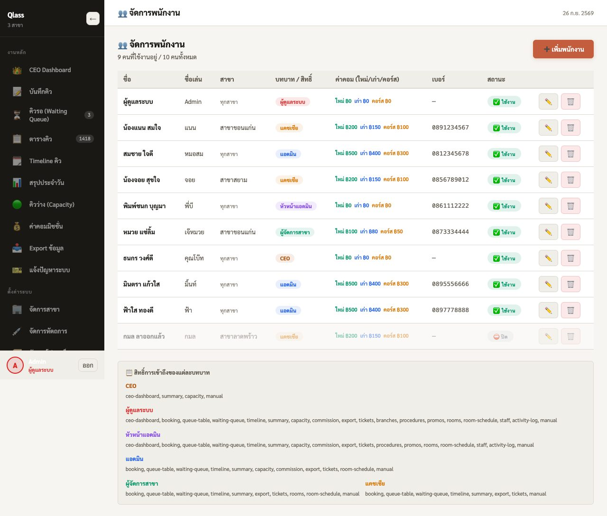
*จัดการพนักงาน: บทบาท สาขา เรตค่าคอม สถานะบัญชี และตารางสิทธิ์ด้านล่าง*

**เพิ่มพนักงาน**

1. กด “➕ เพิ่มพนักงาน”
2. กรอก “ชื่อ-นามสกุล” (บังคับ), “ชื่อเล่น / ชื่อย่อ” (ใช้ค้นหาตอนล็อกอินและแสดงในรายงาน), “เบอร์โทร”
3. เลือก “บทบาท / สิทธิ์” — ใต้ช่องจะบอก “เข้าถึงได้: n หน้า”
4. เลือก “สาขาประจำ” — ผู้จัดการสาขา/แคชเชียต้องเลือก 1 สาขา ส่วนบทบาทที่เห็นทุกสาขาจะถูกล็อกเป็น “ทุกสาขา”
5. ตั้ง “PIN (4 หลัก)” ตัวเลขล้วน (กด “แสดง” เพื่อดู) — บอกพนักงานให้จำและไม่แชร์
6. ตั้ง “💰 ค่าคอมมิชชั่น (฿ ต่อคิว)” 3 ช่อง: ลูกค้าใหม่ / ลูกค้าเก่า / ใช้คอร์ส (เป็นบาทต่อคิว ไม่ใช่ %)
7. กด “💾 บันทึก” → “บันทึกข้อมูลพนักงานเรียบร้อย”

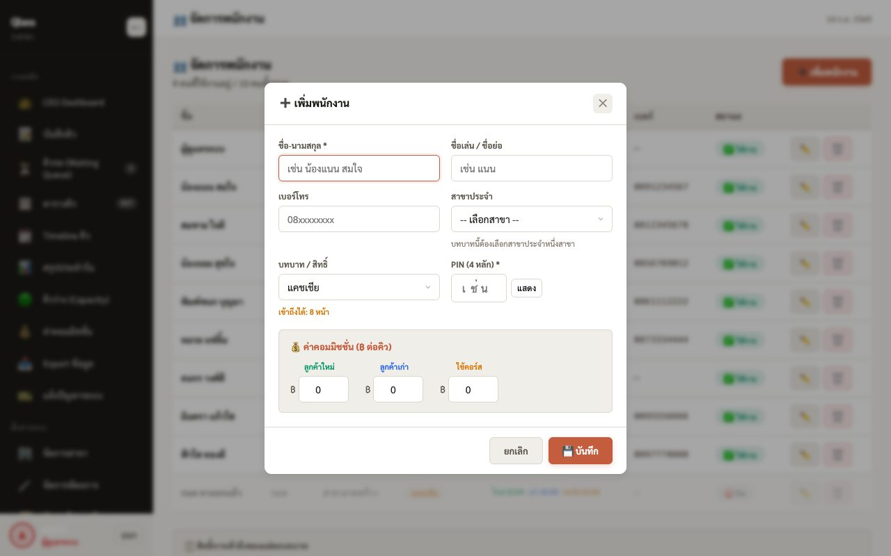
*หน้าต่างเพิ่มพนักงาน: บทบาท สาขาประจำ PIN 4 หลัก และค่าคอมมิชชั่นต่อคิว*

**จัดการบัญชีเดิม**

- กดป้าย “✅ ใช้งาน” / “⛔ ปิด” ในตารางเพื่อเปิด/ปิดบัญชีทันที (ไม่มีหน้าต่างยืนยันและไม่มีข้อความแจ้ง แถวจะจางลง) บัญชีที่ปิดจะหายจากหน้าล็อกอินและหลุดจากระบบในการกดครั้งถัดไป ประวัติคิวยังอยู่ — แนะนำให้ “ปิด” แทน “ลบ” เมื่อพนักงานลาออก แต่ให้จ่ายค่าคอมค้างให้เสร็จก่อน เพราะหน้าค่าคอมมิชชั่นจะไม่แสดงคนที่ปิดแล้ว (ยังดูได้จาก Export → สรุปค่าคอมพนักงาน) ในหน้าต่างแก้ไขก็มีปุ่ม “✅ ใช้งานอยู่ / ⛔ ปิดการใช้งาน” ให้เช่นกัน
- ✏️ แก้ไขข้อมูล/เปลี่ยน PIN/เปลี่ยนบทบาท — ถ้าแก้บัญชีตัวเอง ระบบจะอัปเดตชื่อที่มุมล่างซ้ายให้ทันที
- 🗑 ลบ → ถาม “ลบพนักงาน "ชื่อ" ออกจากระบบ?” — ลบแล้วคิวที่คนนั้นบันทึกจะกลายเป็น “ไม่ระบุผู้บันทึก” ในหน้าค่าคอม ส่วนการลบบัญชีตัวเองระบบจะไม่ทำให้ (และไม่มีข้อความแจ้ง)
- หัวหน้าจอแสดง “n คนที่ใช้งานอยู่ / m คนทั้งหมด” และด้านล่างมีตาราง “📋 สิทธิ์การเข้าถึงของแต่ละบทบาท” สำหรับอ้างอิง

**ข้อความเตือน**

| ข้อความ | สาเหตุ |
| --- | --- |
| ปุ่มบันทึกเป็นสีจาง กดไม่ได้ | ชื่อว่าง หรือ PIN ไม่ครบ 4 หลัก หรือบทบาทผู้จัดการสาขา/แคชเชียแต่ยังไม่เลือกสาขา — เติมให้ครบปุ่มจะเปิด |
| บันทึกไม่สำเร็จ ข้อมูลยังอยู่ครบ กรุณาลองอีกครั้ง | เซิร์ฟเวอร์ปฏิเสธ เช่น ค่าคอมติดลบ — ตรวจค่าแล้วลองใหม่ |

> ⚠️ **ข้อควรระวัง**
> - ระบบไม่ตรวจ PIN ซ้ำหรือชื่อซ้ำ — ตั้ง PIN ให้ต่างกันเพื่อให้รายงานค่าคอมถูกคน
> - หัวหน้าแอดมินสามารถสร้างบัญชีระดับผู้ดูแลระบบได้ ควรตกลงในทีมว่าใครมีสิทธิ์สร้างบัญชีระดับสูง

---

# กติกาและปัญหาที่พบบ่อย

## 📏 กติกาสำคัญที่ใช้ทั้งระบบ

สรุปกติกาที่ทุกหน้าใช้ร่วมกัน อ่านหน้านี้หน้าเดียวก็เข้าใจว่าทำไมระบบถึงยอม/ไม่ยอมบางอย่าง

- เวลาคิดเป็น “บล็อค” ละ 5 นาที ระยะเวลาหัตถการตั้งเป็นบล็อค เวลาเปิดห้องปกติ 11:00–20:00 (ปรับได้รายห้อง) ระบบรองรับ 08:00–24:00
- คิวใหม่ที่นัด “วันนี้” ได้สถานะ “ยืนยันแล้ว” อัตโนมัติ (ทั้งหน้าบันทึกคิว, Timeline และเรียกคิวรอเข้า) คิวล่วงหน้าเริ่มที่ “รอยืนยัน” — แต่ถ้าแก้ไขคิวเดิมย้ายวันมาเป็นวันนี้ สถานะจะไม่เปลี่ยนเอง ต้องกดยืนยันที่ “📋 สถานะ”
- 12:00 คือเวลาตัดรอบ (ค่าเดียวทั้งระบบ ตั้งต่างกันรายสาขาไม่ได้): คิววันนี้ที่ยังไม่ยืนยันหลังเที่ยงจะติดธง “⚠️ เลยเวลายืนยัน” แต่ระบบไม่ย้ายให้ ต้องกด “➡️ ย้ายเข้าคิวรอ” เอง — จากตารางคิวมีหน้าต่างยืนยัน จาก Timeline ย้ายทันที
- ย้ายเข้าคิวรอ = ปล่อยห้อง/เวลาทันที ข้อมูลเดิมถูกเก็บในหมายเหตุ “🕐 เดิมนัด …”
- คิว ยกเลิก / ไม่มาตามนัด / เลื่อนออก ไม่ครองช่องเวลา จองทับได้
- การเลื่อนนัดสร้างคิวใหม่ (“เลื่อนมา (ใหม่)”) และเก็บคิวเดิมไว้เป็นประวัติ (“เลื่อนออก”) รายงานส่วนใหญ่จึงไม่นับคิว “เลื่อนมา (ใหม่)” ซ้ำ
- เตียงที่ยังไม่ตั้งค่าล็อก ใช้กติกา M/T; เตียงที่ล็อกแล้วรับเฉพาะที่ติ๊ก; “ปิดคิว”, “โปรประจำเดือน (T)”, “Influencer”, “ปรึกษาทั่วไป” ลงได้ทุกเตียงเสมอ
- “ปิดคิว” เป็นหัตถการพิเศษไว้จองช่องเวลาไม่ให้ใครลง (เช่น พัก, ประชุม) ไม่ใช่บริการจริง
- หน้าบันทึกคิวไม่ให้ลงคิวใหม่ย้อนหลัง (แก้ไขคิวเดิมย้อนหลังได้) ส่วน Timeline ยอมให้ลงย้อนหลังได้ ใช้เฉพาะเมื่อตั้งใจบันทึกคิวเก่าที่ตกหล่น
- เมื่อคิวมีห้อง เวลา และหัตถการ ระบบจะตรวจเวลาชนจากฐานข้อมูลสดทุกครั้ง ถ้าตรวจไม่ได้จะไม่บันทึก (คิวที่ไม่ระบุหัตถการจะไม่ถูกตรวจ)
- กดซ้ำไม่สร้างข้อมูลซ้ำ และเมื่อบันทึกล้มเหลว ข้อมูลในฟอร์มยังอยู่ครบเสมอ
- ลบคิวได้ทุกบทบาทที่เห็นคิว ต้องพิมพ์ชื่อลูกค้ายืนยัน และมีบันทึกชื่อผู้ลบใน “ประวัติการลบ”
- ค่าคอมและรายได้นับเฉพาะสถานะ “มาแล้ว / เสร็จ” และนับตาม “วันนัด”; ผลงานแอดมินใน CEO Dashboard นับตาม “วันที่ลงคิว”
- ค่าคอมเป็นของคนที่ “ลงคิวครั้งแรก” เสมอ — การแก้ไขคิว การเรียกเข้าจากคิวรอ หรือการเลื่อนนัด ไม่เปลี่ยนชื่อผู้บันทึก; คิวประเภท “ใช้คอร์ส” ก็ได้ค่าคอมตามเรตช่องคอร์ส; ลบคิว = ค่าคอมของคิวนั้นหายไปด้วย
- ทุกหน้าอัปเดตเองเมื่อเครื่องอื่นบันทึก (Realtime) ไม่ต้องรีเฟรช ทั้งตารางคิว Timeline คิวรอ และรายงาน
- ตอนเปิดแอประบบโหลดคิวย้อนหลัง 30 วัน ดูเก่ากว่านั้นจะมีแถบ “⏳ กำลังโหลดข้อมูล…” รอให้หายก่อนอ่านตัวเลข

## ❓ ปัญหาที่พบบ่อยและวิธีแก้

**ถาม: เข้าสู่ระบบไม่ได้ ขึ้น “PIN ไม่ถูกต้อง ลองใหม่” ทั้งที่กดถูก**

ตอบ: มี 3 สาเหตุ: อินเทอร์เน็ตหลุด (ลองรีเฟรช), กดผิดครบ 5 ครั้งจนถูกพัก 15 นาที (รอแล้วลองใหม่), หรือบัญชีถูกปิดใช้งาน ให้หัวหน้าแอดมินตรวจในจัดการพนักงาน ถ้ายังไม่ได้ ให้หัวหน้าแอดมินตั้ง PIN ใหม่

**ถาม: หาชื่อตัวเองในหน้าล็อกอินไม่เจอ**

ตอบ: หน้าล็อกอินแสดงเฉพาะบัญชีที่เปิดใช้งาน ลองพิมพ์ชื่อเล่น ถ้ายังไม่เจอให้หัวหน้าแอดมินเช็กว่าบัญชีเป็น “⛔ ปิด” อยู่หรือไม่

**ถาม: ลงคิวแล้วขึ้น “เวลาชนกับคิวของ …” ทั้งที่หน้าจอเห็นว่าว่าง**

ตอบ: มีคนลงจากเครื่องอื่นเมื่อครู่ ระบบตรวจจากฐานข้อมูลสด หน้าจอจะอัปเดตช่องนั้นให้ ให้เลือกเวลาอื่น

**ถาม: เลือกหัตถการไม่ได้ / หัตถการหายไปจากรายการ**

ตอบ: รายการหัตถการขึ้นกับห้องที่เลือก (M/T หรือ 🔒) เปลี่ยนห้อง หรือให้ผู้จัดการสาขาตรวจการติ๊กที่จัดการห้อง ถ้าการ์ดสาขาขึ้น “⚠️ สาขานี้ยังไม่มีเตียงไหนรับ” ต้องแก้ที่นั่น

**ถาม: ขึ้น “❌ … ไม่รับคิว …” ทั้งที่เมื่อวานลงได้**

ตอบ: มีคนตั้งค่าล็อกเตียงเพิ่ม เลือกเตียงที่มีเครื่องนั้น หรือถ้าเตียงนี้ทำได้จริงให้ผู้จัดการสาขาติ๊กเพิ่ม

**ถาม: ช่องเวลาเป็นสีเทาทั้งเตียง**

ตอบ: ถ้ามีป้าย ⛔ บนหัวคอลัมน์ = เตียงถูกปิดวันนั้น (ปุ่มกดปิดเตียง หรือรายการ ⛔ ในตารางห้อง/เครื่อง) ให้เปิดคืนที่ต้นทาง ถ้าไม่มีป้าย = เวลาเปิด-ปิดของเตียงนั้นแคบกว่าเตียงอื่นในสาขา ให้ผู้จัดการสาขาตรวจ “เวลาเปิด-ปิดเริ่มต้น” ในจัดการห้อง

**ถาม: คิวหายไปจากตารางคิว**

ตอบ: เช็ก 3 ที่: (1) เมนูคิวรอ แท็บ “⚠️ คิวไม่ยืนยัน” (ถูกย้าย) (2) ตัวกรองสถานะ/ห้อง/ค้นหาที่ค้างอยู่ (3) เมนูประวัติการลบ (หัวหน้าแอดมิน) ว่าถูกลบโดยใคร

**ถาม: ค่าคอมไม่ขึ้น**

ตอบ: คิวต้องมีสถานะ “🎉 มาแล้ว / เสร็จ” และวันนัดอยู่ในช่วงที่เลือก และผู้บันทึกต้องเป็นบัญชีที่ยังอยู่ในระบบพร้อมตั้งเรตค่าคอมไว้

**ถาม: ตัวเลขในหน้าสรุป/CEO ไม่ตรงกับที่จำได้**

ตอบ: ดูว่าแถบ “⏳ กำลังโหลดข้อมูล…” หายหรือยัง และดูว่าตัวเลขนั้นนับตาม “วันนัด” หรือ “วันที่ลงคิว” — สองแกนนี้ต่างกันโดยตั้งใจ

**ถาม: หน้าจอขึ้น “🎯 โหมดตัวอย่าง”**

ตอบ: ระบบต่อฐานข้อมูลไม่ได้ ข้อมูลที่เห็นเป็นข้อมูลสาธิต ห้ามบันทึกงานจริง แจ้งผู้ดูแลระบบทันที

**ถาม: แถบเหลือง “มีเวอร์ชันใหม่…” ขึ้นตลอด**

ตอบ: กด “รีเฟรชตอนนี้” เมื่อไม่ได้กรอกฟอร์มค้างอยู่ ระบบจะโหลดเวอร์ชันใหม่ ข้อมูลที่บันทึกแล้วไม่หาย

**ถาม: แก้ไขคิวบนเตียงที่ปิดแล้วไม่ผ่าน**

ตอบ: แก้ชื่อ/เบอร์/ราคาผ่านได้ แต่ถ้าย้ายเตียง/เลื่อนเวลา/เปลี่ยนหัตถการ ต้องเปิดเตียงคืนก่อน หรือย้ายคิวไปเตียงอื่นที่เปิด

**ถาม: วางข้อความจาก LINE แล้วชื่อไม่ขึ้น**

ตอบ: ข้อความบรรทัดเดียวที่มีเบอร์ปนอยู่ระบบจะอ่านชื่อไม่ได้ พิมพ์ชื่อเองหรือแยกบรรทัด

**ถาม: อยากลบคิวแต่ปุ่ม “ลบ” กดไม่ได้**

ตอบ: ต้องพิมพ์ชื่อลูกค้าให้ตรงทุกตัวอักษร (รวมเว้นวรรคระหว่างคำ) ปุ่มจึงจะเปิด

**ถาม: ต้องการดูคิวเก่ากว่า 1 เดือน**

ตอบ: เลือกวันที่ในตัวกรองได้เลย ระบบจะโหลดเพิ่มให้ ถ้าขึ้น “⚠️ โหลดข้อมูล … ไม่สำเร็จ” กด “ลองใหม่”

**ถาม: คิววันนี้เลยเที่ยงแล้วยังไม่ยืนยัน หรือลูกค้าไม่มา ต้องกดอะไร**

ตอบ: ดู 3 กรณี: (1) ยังไม่ถึงเวลานัด ติดต่อไม่ได้ → กด “📋 สถานะ” บันทึก “📞 โทรตาม” ทุกครั้งที่โทร (2) อยากปล่อยช่องเวลาให้คนอื่นระหว่างรอ → กด “➡️ ย้ายเข้าคิวรอ” (คิวไปรอในเมนูคิวรอ ไม่นับเป็นไม่มา) (3) เลยเวลานัดไปแล้วและลูกค้าไม่มา → “📋 สถานะ” → “🚫 ไม่มาตามนัด” (นับในรายงานอัตราไม่มา) — เกณฑ์ว่า “เลยเวลานัดกี่นาทีถือว่าไม่มา” ให้ยึดตามที่หัวหน้าสาขากำหนด

**ถาม: เผลอลงคิวซ้ำ 2 คิว**

ตอบ: เปิดตารางคิว ค้นชื่อ/เบอร์ จะเห็น 2 แถว ให้กด “🗑️ ลบ” ที่แถวที่ข้อมูลผิดหรือแถวที่ลงทีหลัง (ถ้าเหมือนกันทุกอย่างลบแถวไหนก็ได้) พิมพ์ชื่อลูกค้ายืนยัน — กรณีลงซ้ำเองใช้ “ลบ” ไม่ใช่ “ยกเลิก” เพราะลูกค้าไม่ได้ยกเลิก ยอดยกเลิกของสาขาจะได้ไม่เพี้ยน

**ถาม: ลูกค้าขอเลื่อนนัด แต่ยังไม่รู้ว่าวันไหน**

ตอบ: ถ้าคิวยังไม่ยืนยัน (รอยืนยัน/โทรตาม) กด “➡️ ย้ายเข้าคิวรอ” ช่องเวลาจะว่างและคิวไปรอในเมนูคิวรอ ถ้าคิว “ยืนยันแล้ว” ให้กด “📋 สถานะ” → “❌ ยกเลิก” ใส่หมายเหตุ “ขอเลื่อน รอแจ้งวัน” แล้วลงคิวรอใหม่ให้ลูกค้า (ชื่อผู้บันทึกจะเป็นคนที่ลงคิวรอใหม่) พอรู้วันค่อย “📞 เรียกเข้า”

**ถาม: ลูกค้าขอย้ายไปทำอีกสาขา หรือย้ายเตียง**

ตอบ: กด “✏️ แก้ไข” ที่คิว เปลี่ยนสาขา/ห้อง แล้วเลือกหัตถการ โปร และเวลาใหม่ (ระบบล้างให้เพราะห้องเปลี่ยน) คิวเดิมจะย้ายทั้งก้อนโดยชื่อผู้บันทึกเดิมยังอยู่ — “📤 เลื่อนออก” ใช้เฉพาะเปลี่ยนวัน/เวลาในห้องเดิม

**ถาม: ลูกค้าอ้างราคาโปรที่ไม่มีในระบบ**

ตอบ: หน้าบันทึกคิวแก้ราคาเองไม่ได้ ให้แจ้งหัวหน้าแอดมินเพิ่มโปรด้วย “➕ เพิ่มโปรด่วน” หรือเลือกโปรใกล้เคียงแล้วใส่ราคาที่ตกลงไว้ในหมายเหตุ (ราคาจริงในคิวจะยังเป็นราคาโปรที่เลือก)

## 📚 คำศัพท์ในระบบ

| คำ | ความหมาย |
| --- | --- |
| บล็อค | หน่วยเวลา 5 นาที ใช้ทั้งระบบ |
| M / T | ประเภทห้อง: M = ห้องฉีด/ห้องหมอ (Injection, Drip), T = ห้องเครื่อง/ทรีตเมนต์ |
| เตียง | แถวหนึ่งในจัดการห้อง = เตียง 1 ตัวพร้อมคนทำ (ไม่ใช่ห้องจริงทางกายภาพ) |
| ล็อก 🔒 | การตั้งค่าว่าเตียงรับหัตถการอะไรได้บ้าง |
| คิวรอ (Waiting Queue) | คิวที่ยังไม่มีห้อง/เวลา |
| เลยเวลายืนยัน | คิววันนี้ที่ยังไม่ยืนยันหลัง 12:00 |
| ย้ายเข้าคิวรอ | ปล่อยห้อง/เวลาของคิวที่ยังไม่ยืนยันให้คนอื่น |
| เลื่อนออก / เลื่อนมา (ใหม่) | คู่สถานะของการเลื่อนนัด: คิวเดิม / คิวใหม่ |
| ปิดคิว | หัตถการพิเศษไว้กันช่องเวลา |
| pre-book | คิวที่ลงวันนี้แต่นัดวันอื่น |
| CPO | ค่าโฆษณาต่อคิว = ค่าโฆษณา ÷ คิวที่แอดมินบันทึก (ลูกค้าใหม่+เก่า) |
| Pro Clinic / HN | Pro Clinic = ระบบเวชระเบียนของคลินิก, HN = รหัสลูกค้าในระบบนั้น Qlass ค้นให้ตอนพิมพ์ชื่อ/เบอร์ |
| Realtime | ทุกเครื่องเห็นการเปลี่ยนแปลงทันทีโดยไม่ต้องรีเฟรช |

<!-- สร้างอัตโนมัติจาก src/manual/manualContent.js — แก้ที่ไฟล์นั้นแล้วรัน npm run manual:docs -->
